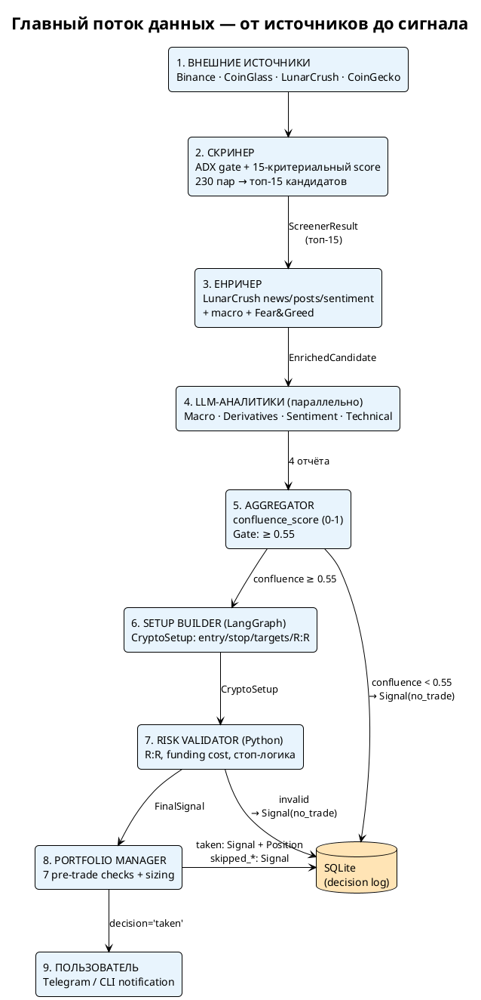
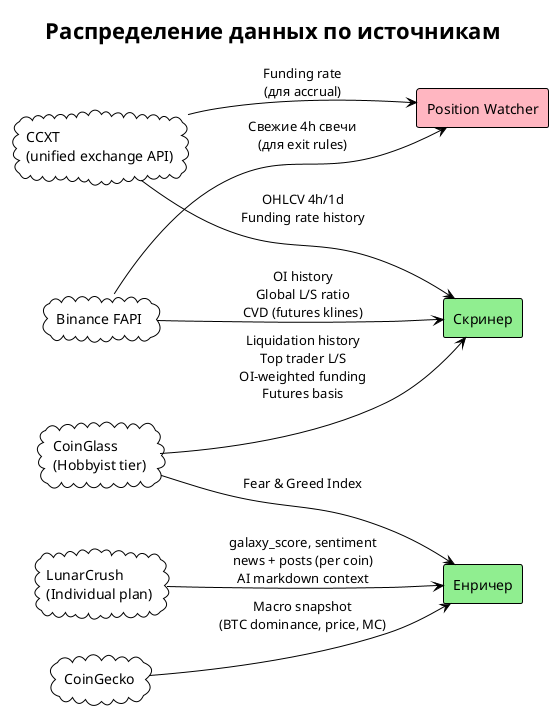
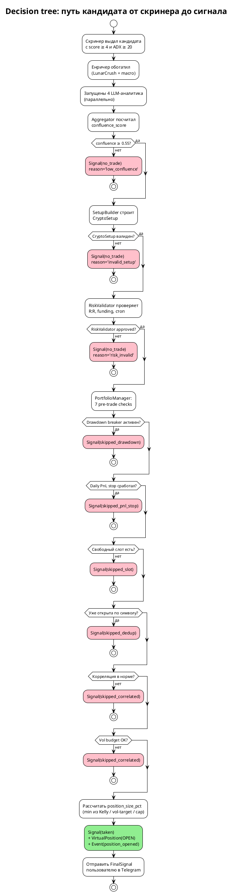
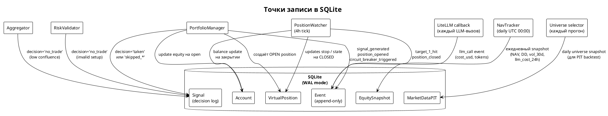
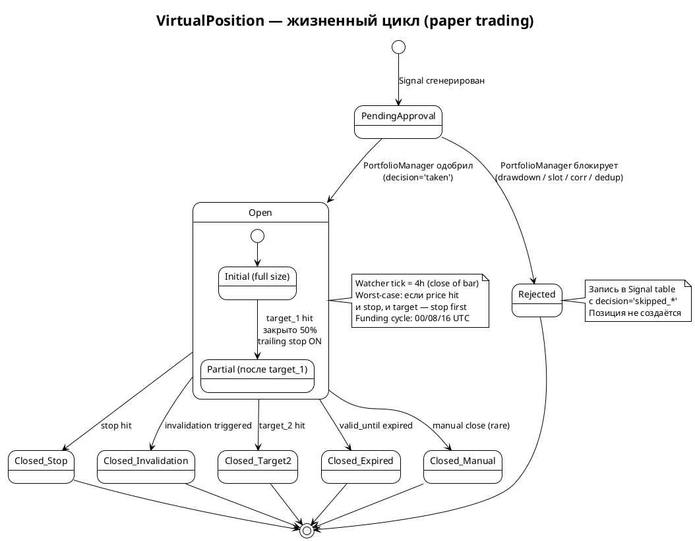
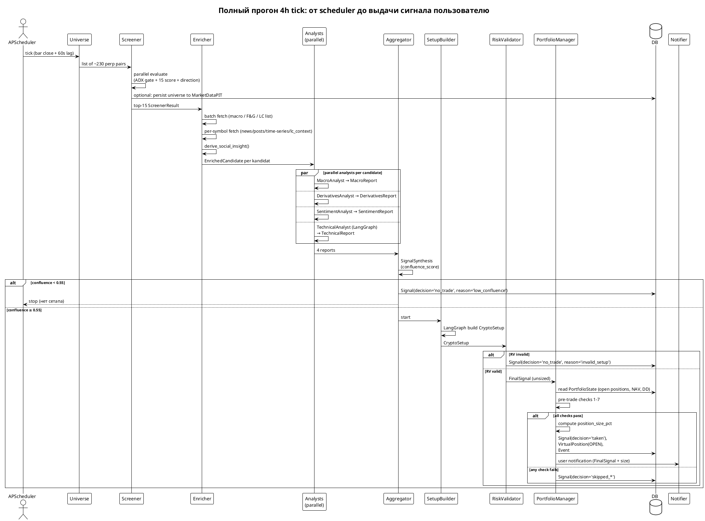

# TradingAgents — Architecture

**Цель**: Генерация торговых сетапов на крипто-рынке (perps/futures).
**Таймфрейм**: Intraday 4h, Long & Short.
**Режим**: Сигналы для человека → в будущем автоматическое исполнение.
**Юниверс**: Все ликвидные perp-пары Binance (≈200–250 пар, мин. объём $5M/24h).

---

## Статус реализации

- ✅ **Universe selection** — готово
- ✅ **Screener (Agent 1)** — готово
- ✅ **Data Enrichment** — готово (LunarCrush + lunarcrush.ai + CoinGecko macro)
- 🔲 **News/Posts LLM-filter** — в планах (Haiku 4.5 pre-classifier для отсева мусорных топик-матчей)
- 🔶 **Deep Analysis (Agent 2+)** — модели готовы (Pydantic), агенты не реализованы
- 🔲 **Setup Builder** — не начато
- 🔲 **Risk Validator** — не начато
- 🔲 **Persistence (SQLite + SQLModel)** — не начато (Итерация 3.5, фундамент для production)
- 🔲 **Position Watcher (paper trading)** — не начато (Итерация 3.6)
- 🔲 **Portfolio Manager + Sizing** — не начато (Итерация 3.7); основа state-aware signals
- 🔲 **Screener IC-weighted refactor** — не начато (Итерация 3.8)
- 🔲 **Performance Tracking (DSR/PSR)** — не начато (Итерация 4); защита от Alpha Illusion
- 🔲 **Regime Detector** — не начато (Итерация 4a: heuristic; 4b: HMM)
- 🔲 **Production Conventions enforcement** — Decimal/UTC/SQLite PRAGMA/backup policies (часть Итерации 3.5)
- 🔲 **LLM Cost Tracking** — daily budget gate + per-signal cost (часть Итерации 2.5)

---

## Карта компонентов

```text
┌──────────────────────────────────────────────────────────────────────────┐
│ ТИП                  │ КОМПОНЕНТ              │ ТЕХНОЛОГИЯ              │
├──────────────────────────────────────────────────────────────────────────┤
│                      │ Screener     ← ГОТОВО  │ asyncio, ccxt,          │
│ Чистый Python        │ DataEnricher ← ГОТОВО  │ python-binance,         │
│ (нет LLM)            │ SocialInsight← ГОТОВО  │ pandas-ta, httpx,       │
│                      │ RiskValidator          │ CoinGlass + LunarCrush  │
│                      │ SignalFormatter        │ + CoinGecko APIs        │
├──────────────────────────────────────────────────────────────────────────┤
│                      │ MacroAnalyst           │                         │
│ LLM-вызов            │ DerivativesAnalyst     │ litellm + instructor    │
│ (analysts/, нет loop)│ SentimentAnalyst       │ response_model=Pydantic │
│                      │ OnChainAnalyst (план)  │                         │
│                      │ SignalAggregator       │                         │
│                      │ ConflictResolver       │                         │
│                      │ DevilsAdvocate         │                         │
├──────────────────────────────────────────────────────────────────────────┤
│ LangGraph граф       │ TechnicalAnalyst       │ StateGraph +            │
│ (agents/, tools+loop)│ SetupBuilder           │ ToolNode + ContextSchema│
├──────────────────────────────────────────────────────────────────────────┤
│                      │ PortfolioManager       │                         │
│ State + Risk         │ Sizing (Kelly+VolTgt)  │ SQLModel + SQLite,      │
│ (Python, нет LLM)    │ PositionWatcher        │ Alembic, pandas,        │
│                      │ DrawdownCircuitBreaker │ scipy.stats для DSR     │
│                      │ NavTracker             │                         │
│                      │ DeflatedSharpe         │                         │
│                      │ RegimeDetector (HMM)   │ hmmlearn                │
└──────────────────────────────────────────────────────────────────────────┘
```

---

## Принципы дизайна

1. **Screener first** — быстрый Python-фильтр по всему юниверсу без LLM; LLM только для прошедших кандидатов.
2. **Параллельность** — все фетчи и LLM-вызовы одного уровня через `asyncio.gather`.
3. **Structured I/O** — числа агентам в JSON, вывод — Pydantic-модель. Защита от hallucination на free-form данных.
4. **Confluence gate** — если `confluence_score < 0.55`, SetupBuilder не запускается. No Trade.
5. **Mandatory setup поля** — никаких `Optional` в `CryptoSetup`. Нет данных = No Trade.
6. **CVD gate** — SetupBuilder проверяет CVD перед генерацией входа: лонг только при накоплении, шорт при распределении.
7. **Python для правил** — RiskValidator никогда не будет LLM. R:R, funding cost, стоп-логика — детерминированная математика.
8. **Vol target вместо return target** — система не задаёт цель по доходности. Задаются: target annualized volatility (20-25%), per-trade risk budget (1% NAV default), max drawdown circuit breakers. Доходность — производная edge × vol_target. Основание: AQR Risk Parity, Man Group "Volatility is Back", Research Affiliates — return target ведёт к over-leverage в low-vol режимах и блокировке хороших сетапов в high-vol.
9. **State-aware signals** — каждый сигнал генерируется с учётом текущего PortfolioState (баланс, открытые позиции, drawdown, корреляции). Pre-trade checks обязательны перед выдачей сигнала пользователю.
10. **Event log + state snapshots** — каждое решение, переход позиции, изменение portfolio state пишется в append-only Event таблицу (audit trail и replay capability). Текущее состояние сущностей хранится в обычных таблицах (mutable state); Event — для истории и восстановления. Bitemporal (`valid_from` / `valid_to`) применяется **только** к `MarketDataPIT` для данных подверженных revisions (funding rate, OI могут уточняться задним числом). OHLCV — append-only без `valid_to`. Основание: MDPI 2673-2688/7/4/117 "Just-in-Time Historical State Reconstruction" для PIT; Greg Young / DDD для event log.
11. **Унифицированная regime-таксономия** — везде в коде используется одна 4-state шкала: `bull` / `bear` / `range` / `volatile`. Это касается и `MacroReport.regime` (LLM-вывод), и `RegimeDetector` (HMM или heuristic в Итерации 4). LLM-аналитик возвращает значение из enum, не свободный текст. Основание: индустриальный консенсус (Imperial College "Data-Driven Market Regime Classification"; BlankCapital 2026 guide; QuantJourney) — 4 состояния это canonical минимум, больше = over-engineering пока нет данных для калибровки.
12. **Funding mechanics — дискретные выплаты, не continuous accrual** — Binance USDⓈ-M perp funding settlement каждые **8 часов** (00:00, 08:00, 16:00 UTC) для большинства символов; **4 часа** для некоторых высоковолатильных пар (с 2023-10-12); **1 час** в редких случаях. Funding платится **только** если позиция держится в exact funding timestamp (есть 1-минутный grace window per Binance docs). У нас в симуляции: проверяем по `funding_timestamp` фактический rate, начисляем единоразово; не пропорционально времени. Основание: Binance FAQ "Introduction to Funding Rates"; ainvest 2023-10-12 announcement.

---

## Production Conventions

Глобальные конвенции, обязательные для всего нового кода. Нарушение = баг.

### Денежные значения и точность

- **Decimal везде** для всего что является деньгами, размером позиции или ценой: `current_balance`, `entry_price`, `qty`, `realized_pnl`, `simulated_fees`, `simulated_funding`. Использовать `decimal.Decimal`, никогда `float`.
- **Float разрешён** только для производных метрик где precision не критична: `confluence_score`, `drawdown_pct`, `vol_30d_annualized`, `attention_ratio`, `correlation`, `sentiment_pct`.
- **SQLite storage**: SQLite не имеет native Decimal. Храним `Decimal` поля **как строки** (TEXT) через TypeDecorator в SQLModel — это безопаснее integer-with-fixed-exponent при разной точности на разные активы. На входе/выходе автоматическая конверсия Decimal ↔ string. Основание: SQLModel docs "Decimal Numbers"; pythontutorials.net Decimal+SQLite.
- **Точность per asset class**: тикеры >$1 — округление до 4 знаков; <$1 — до 8 знаков; sub-cent meme-coins — до 10. Конкретные правила в `Quantize` helper'е (один централизованный) — не дублировать quantize-логику в каждом модуле.
- **Quantize только при записи в БД и при отображении пользователю**. Внутренние расчёты — full precision.

### Время и timezone

- **Только UTC-aware datetime**. `datetime.now(timezone.utc)` всегда, `datetime.now()` запрещён linter'ом.
- **ISO 8601 string в JSON-полях** (`Event.payload_json`, `Signal.setup_json`) с suffix `Z`.
- **Bar-close lag**: тики scheduler'а на закрытие 4h свечи + **60 секунд** (T+60s). За эту минуту данные источников успевают пропагироваться (CCXT cache invalidation, CoinGlass refresh). До T+60s — гарантированно stale.

### Конфигурация и пути

- **Database path**: env var `TRADINGAGENTS_DB_PATH`, default `~/.tradingagents/trading.db`. Директория создаётся автоматически на init.
- **Все API keys** — только через env vars, никогда в конфиге, никогда в логах. Logger sanitizer должен фильтровать значения переменных, содержащих в имени `KEY` / `TOKEN` / `SECRET` / `PASSWORD`.
- **Settings** — Pydantic Settings класс с явной валидацией констант: `MAX_CONCURRENT_POSITIONS: int = Field(default=6, ge=1, le=20)`, и т.п. Нет magic numbers вне settings.

### SQLite production-режим

При инициализации соединения обязательно применяются PRAGMA:
- `journal_mode=WAL` — высокая concurrent throughput
- `synchronous=NORMAL` — баланс safety/speed (industry standard для WAL)
- `busy_timeout=5000` — 5s wait перед "database locked"
- `foreign_keys=ON` — FK constraints включены по умолчанию выключены
- `cache_size=-64000` — 64MB cache
- `temp_store=MEMORY` — temp tables в RAM

Основание: travishorn.com "SQLite for Production"; calmops.com SQLite ops guide; dev.to "SQLite WAL Mode 10x Performance".

### Backup и rotation БД

- **Daily backup** через SQLite native `.backup()` API (или `VACUUM INTO`) — НЕ OS-level copy (.db файла), потому что в WAL режиме это может дать corrupted snapshot.
- **Storage**: ротация 7 дней локально + опционально weekly upload в external storage.
- **Никогда** не копировать через `cp` / `rsync` живую `.db` без snapshot файловой системы (или хотя бы `PRAGMA wal_checkpoint(TRUNCATE)` сначала).

Основание: sqlite.org forum "Hot backup database in WAL mode"; oldmoe.blog "Backup strategies for SQLite in production".

### Idempotency

- **Signal** уникален по `(symbol, bar_close_ts)` — UNIQUE constraint, при дубле — `ON CONFLICT IGNORE`. Защита от двойного запуска scheduler'а на ту же свечу (ребут, ручной rerun).
- **VirtualPosition** уникальна по `(account_id, symbol, state='OPEN')` — partial unique index. Невозможно открыть две одновременные позиции на один тикер.

### Recovery после crash

При старте процесса (любого: scheduler, watcher):
1. **Replay last events**: прочесть последние `N=100` Event записей; пройтись по уникальным `(entity_type, entity_id)` и убедиться что фактическое состояние сущностей соответствует последнему event'у.
2. **Sync open positions**: для каждой `VirtualPosition.state='OPEN'` запросить свежую цену; если за время downtime были hit'ы stop/target — синтетически закрыть позицию задним числом, exit_ts = первая 4h свеча после downtime где условие сработало.
3. **Universe snapshot consistency**: убедиться что `MarketDataPIT(field='universe')` имеет запись на сегодня; если нет — refresh.
4. **APScheduler jobs**: используется `SQLAlchemyJobStore` с тем же SQLite файлом — jobs выживают рестарт автоматически.
5. **Логировать recovery action в Event** с `event_type='recovery_run'`.

Основание: APScheduler 3.x docs (persistent jobstore pattern); event sourcing standard recovery procedure.

### LLM cost tracking

- Каждый LLM-вызов через `litellm` использует `success_callback` который пишет `{model, prompt_tokens, completion_tokens, cost_usd, latency_ms}` в `Event.payload_json` с `event_type='llm_call'`, `entity_type='signal'`, `entity_id=<signal_id>`.
- Daily cron агрегирует cost-per-signal в `EquitySnapshot.llm_cost_24h` (новое поле).
- Hard budget: env var `LLM_DAILY_BUDGET_USD` (default $5); при превышении новые LLM-вызовы блокируются, signal записывается с `decision='no_trade', reason='llm_budget_exceeded'`.

Основание: LiteLLM docs cost tracking; стандартный SaaS budget control pattern.

### Языковая конвенция

- **LLM outputs**: все `reasoning`, `key_insight`, `thesis`, `entry_reasoning` от агентов — на **английском**. Промпты тоже на английском. Причина: модели лучше работают на английском для финансового домена, токены дешевле.
- **User-facing**: Telegram-уведомления, CLI вывод — на **русском**. Final translation/formatting в `SignalFormatter`.
- **Логи**: на **английском** (industry standard, проще grep).

### Тесты и CI

- **Unit-coverage**: новый код ≥ 70%. Critical paths (sizing math, P&L формула, state machine transitions, DSR расчёт) — 100%.
- **Property-based** (hypothesis): position math invariants — `realized_pnl_long = qty × (exit − entry) − fees − funding` всегда; `current_stop` после trailing никогда не хуже initial_stop для long.
- **Integration**: full pipeline screener → enricher → mocked LLM → portfolio → virtual position → close. Без реальных бирж и LLM.
- **CI gates**: ruff (linting), mypy strict на новый код, pytest с coverage gate, alembic upgrade head dry-run.

### Manual override

CLI команды для ручного вмешательства (для редких случаев):
- `manual-signal --symbol BTC/USDT --side long --entry 65000 --stop 64000 --target 67000` — создаёт `Signal(source='manual')` и проходит обычные pre-trade checks.
- `force-close --position-id N --reason "manual"` — закрывает VirtualPosition вне watcher loop.
- `halt-trading [--reason]` / `resume-trading` — ручной circuit breaker override (пишет Event).

Все manual actions помечены `source='manual'` и пишутся в Event для аудита.

---

## Пайплайн — чистый Python

```text
ШАГ 1 — UNIVERSE
  Источник: все ликвидные perp-пары Binance
  Фильтры: swap=True, quote=USDT, active=True, quoteVolume ≥ $5M/24h
  Результат: список ~230 пар, отсортированных по объёму убыванием.
  (В production эти универс-снапшоты фиксируются в MarketDataPIT для PIT-backtest.)

ШАГ 2 — SCREENER  ← РЕАЛИЗОВАН
  Параллельная оценка каждой пары (concurrency 15, ограниченная semaphore):

  A. DATA FETCH (параллельно через asyncio.gather):
     • OHLCV 4h × 200 свечей (~33 дня)           ← CcxtClient
     • OHLCV 1d × 100 свечей (~3 месяца)          ← CcxtClient
     • Funding rate история × 21 период (7 дней)  ← CcxtClient
     • Open Interest 4h × 50 точек (~8 дней)      ← BinanceClient (FAPI)
     • Global L/S ratio текущий                   ← BinanceClient (FAPI)
     • CVD фьючерсный × 24 свечи 4h (~4 дня)      ← BinanceClient (FAPI futures_klines)

  B. ADX GATE (обязателен, иначе монета отсеивается):
     • ADX(14) на 4h ≥ 20.0
     • Смысл: фильтрует боковики — в ranging рынке все momentum-сигналы = шум

  C. COINGLASS FETCH (параллельно, при ошибке — пустые сигналы, не стоп):
     • Liquidation aggregated history × 50 точек  ← CoinGlassClient (Hobbyist)
     • Top trader position ratio текущий          ← CoinGlassClient (Hobbyist)
     • OI-weighted funding rate × 21 периодов     ← CoinGlassClient (Hobbyist)
     • Futures basis history × 1 точка            ← CoinGlassClient (Hobbyist)

  D. SCORE — каждый сработавший критерий +1 (max=15):

     Рыночная активность (non-directional, score only):
     ┌────────────────────────────────────────────────────────────┐
     │ volume_spike     │ Объём 4h > 1.5× SMA(20) объёма         │
     │ bb_squeeze       │ (BB_upper − BB_lower) / mid < 2%       │
     │ near_swing       │ Цена в 0.5×ATR от swing H/L (1D, 50d) │
     └────────────────────────────────────────────────────────────┘

     Momentum сигналы (любое направление):
     ┌────────────────────────────────────────────────────────────┐
     │ ema_cross        │ EMA(20) пересекла EMA(50) на 4h        │
     │ rsi_divergence   │ RSI-дивергенция за 20 свечей 4h        │
     │ macd             │ Гистограмма MACD(12,26,9) > 0 и растёт │
     │                  │ или < 0 и падает                       │
     │ cvd_price_div    │ Цена и CVD расходятся                  │
     │ rsi_extreme      │ RSI ≥ 70 или ≤ 30                      │
     └────────────────────────────────────────────────────────────┘

     Derivatives сигналы:
     ┌────────────────────────────────────────────────────────────┐
     │ ls_ratio_extreme │ Retail L/S > 3.3 или < 0.55 (контрарн.)│
     │ top_ls_extreme   │ Top trader L/S > 3.3 или < 0.55        │
     │ trend+vwap       │ daily_trend="up" + vwap_bias="above"   │
     │                  │ или "down" + "below"                   │
     │ funding_bias     │ funding_rate > +0.15% или < −0.05%     │
     │                  │ (CoinGlass OI-weighted приоритет;      │
     │                  │ CCXT Binance — fallback; один сигнал)  │
     │ oi_trend         │ OI growing или shrinking за 32h (≥15%) │
     │ oi_change_4h     │ |ΔOI за 4h| ≥ 5%                      │
     │ liq_spike        │ Сумма ликвидаций > 3× среднее (окно 8) │
     └────────────────────────────────────────────────────────────┘

  E. DIRECTION — голосование по 11 направленным сигналам:
     +1 голос за bullish, −1 за bearish каждого из:
       ema_cross, rsi_divergence, macd, cvd_price_divergence,
       daily_trend, vwap_bias, cvd_trend,
       long_short_ratio (контрарно), top_trader_ls_ratio (directional),
       funding (CoinGlass OI-weighted или Binance — один объединённый голос),
       basis (контанго=+1, бэквордация=−1)
     Не голосуют (только score): volume_spike, bb_squeeze, near_swing,
       rsi_extreme, oi_change_4h, oi_trend, liq_spike
     Итог: votes ≥ +3 → "long" | votes ≤ −3 → "short" | иначе → "mixed"

  F. РЕЗУЛЬТАТ:
     gate_passed=True И score ≥ 4
     Сортировка по score убыванием, топ-15
     Каждый ScreenerResult содержит: symbol, score, adx, direction, signals{}

ШАГ 3 — DATA ENRICHMENT  ← РЕАЛИЗОВАН
  Для каждого топ-N кандидата от скринера — обогащение из LunarCrush + CoinGecko + CoinGlass.

  A. ОДИН batch-fetch на прогон (параллельно):
     • Macro snapshot (BTC price/24h/7d, dominance, total mc 24h)  ← CoinGeckoClient
     • Fear & Greed (последнее значение)                            ← CoinGlassClient
     • LunarCrush /coins/list/v1 (top 1000)                         ← LunarCrushClient
       → {symbol → metrics}: galaxy_score, sentiment, alt_rank,
         categories, social_volume_24h, interactions_24h, topic
       → topic-slug = последнее слово поля `topic` ("btc bitcoin" → "bitcoin")

  B. PER-SYMBOL fetch (для каждого кандидата параллельно):
     • /topic/{topic}/news/v1   (10 шт, отсортированы LC по interactions_24h)
     • /topic/{topic}/posts/v1  (30 шт)
     • /coins/{coin}/time-series/v2  (7 дней daily bucket, для baseline)
     • lunarcrush.ai/topic/{topic}    (LLM-ready markdown: engagements/sentiment
                                        history/инфлюенсеры) → lc_context
     • [опционально] /topic/{topic}/whatsup/v1 — выключено по умолчанию
       (Builder-план; контент дублируется в lc_context)

  C. RATE LIMITING:
     Все запросы LC + lunarcrush.ai через общий leaky-bucket лимитер
     (9 req/min, shared между всеми endpoints LC).

  D. DERIVE INSIGHT (детерминированно, без LLM):
     ScreenerResult + LC данные → SocialInsight per candidate:
     • attention_level: silent/normal/spike — отношение social_volume_24h
       к baseline (среднее posts_active за 7 дней, исключая текущий неполный)
     • sentiment_direction: bullish/bearish/mixed/unknown по порогам 60/40
     • contrarian_warning: True при extreme sentiment (≥85% / ≤15%)
     • momentum: improving/deteriorating/flat — композит galaxy_delta + alt_rank_delta
     • screener_alignment: confirms/contradicts/neutral — sentiment vs screener direction
     • fresh_catalyst + catalyst_polarity: топ-1 свежая новость по interactions
     • top_news, top_posts (top-5), influencer_mentions (followers ≥ 100k)

  E. ИТОГ:
     EnrichmentResult{candidates: list[EnrichedCandidate], macro, fear_greed}
     Каждый EnrichedCandidate: screener + social + lc_context (markdown)

ШАГ 4 — DEEP ANALYSIS  [не реализован]
  Параллельно для каждого EnrichedCandidate запускается analyze_candidate.
  Детали — см. раздел "Deep Analysis пайплайн (один кандидат)".
```

---

## Deep Analysis пайплайн (один кандидат)

Для каждого кандидата прошедшего скринер + энричер выполняются три уровня анализа:

**Уровень 1 — параллельные LLM-аналитики**

Запускаются одновременно четыре аналитика — три прямых LLM-вызова и один LangGraph-граф:
- MacroAnalyst — режим рынка по BTC dominance, цене, 24h/7d
- DerivativesAnalyst — интерпретация funding/OI/L-S/basis из ScreenerResult
- SentimentAnalyst — SocialInsight + lc_context (markdown от lunarcrush.ai)
- TechnicalAnalyst — LangGraph граф с tools (OHLCV, indicators, key levels), итеративные tool-calls

Если какой-то аналитик падает — пайплайн прерывается с записью причины в decision log. Кандидат не идёт дальше.

**Уровень 2 — агрегация и разрешение конфликтов**

SignalAggregator получает все четыре отчёта и формирует SignalSynthesis с полями: overall_bias, confluence_score (0-1), has_significant_conflict, scores_by_analyst, top_risks, reasoning.

Если has_significant_conflict=True — запускается ConflictResolver, который аргументированно выбирает позицию или решает "No Trade".

**Confluence gate**: если итоговый confluence_score < 0.55 — кандидат отбрасывается, SetupBuilder не запускается. Решение записывается в decision log как No Trade с причиной "low_confluence".

**Уровень 3 — генерация сетапа**

SetupBuilder (LangGraph граф) с доступом к tools: текущая цена, key_levels, liquidation clusters. Возвращает CryptoSetup со всеми обязательными полями (entry, stop, target_1, target_2, R:R, invalidation). Если SetupBuilder не может построить валидный сетап (например CVD gate не пройден) — None и решение в лог.

DevilsAdvocate критикует готовый сетап.

RiskValidator (детерминированный Python) проверяет R:R, funding cost, стоп-логику. Если invalid — No Trade.

SignalFormatter собирает финальный FinalSignal.

**Между Уровнем 3 и пользователем** — PortfolioManager с pre-trade checks (см. раздел Portfolio Management). FinalSignal либо доходит до пользователя как `taken`, либо отклоняется (`skipped_correlated` / `skipped_drawdown` / `skipped_slot` / `skipped_dedup`) — в любом случае запись в decision log.

---

## Источники данных

### Реализованные клиенты

| Клиент | Данные | Ограничения |
| --- | --- | --- |
| `CcxtClient` | OHLCV 4h/1d, funding rate история | Один exchange на сессию, markets 1 раз |
| `BinanceClient` | OI история, Global L/S ratio, CVD (futures) | Только Binance FAPI |
| `CoinGlassClient` | OI aggregated, liquidations, top position ratio, OI-weighted funding, basis history, Fear & Greed, altcoin season, CVD aggr.(S+) | 100 req/min; leaky bucket + Event gate |
| `CoinGeckoClient` | Macro snapshot: BTC price/24h/7d, dominance, total market cap 24h | Free tier OK для 1 запроса/прогон |
| `LunarCrushClient` | `/coins/list/v1` (galaxy_score, sentiment, categories, alt_rank, social_volume); `/topic/{topic}/news\|posts/v1`; `/coins/{coin}/time-series/v2`; `lunarcrush.ai/topic/{topic}` (LLM-ready markdown) | Individual план: 10 req/min shared **на все эндпоинты включая lunarcrush.ai**; 2000/day. Общий leaky-bucket 9 req/min |

### Таблица данных

| Данные                        | Источник       | Клиент              | Статус             |
|-------------------------------|----------------|---------------------|--------------------|
| OHLCV perps 4h/1d             | Binance        | `CcxtClient`        | ✅ работает        |
| Funding rate история          | Binance        | `CcxtClient`        | ✅ работает        |
| Open Interest 4h история      | Binance FAPI   | `BinanceClient`     | ✅ работает        |
| Global L/S ratio              | Binance FAPI   | `BinanceClient`     | ✅ работает        |
| CVD фьючерсный                | Binance FAPI   | `BinanceClient`     | ✅ работает        |
| OI aggregated (все биржи)     | CoinGlass      | `CoinGlassClient`   | ✅ работает        |
| Liquidation aggregated hist.  | CoinGlass      | `CoinGlassClient`   | ✅ работает        |
| Top position ratio            | CoinGlass      | `CoinGlassClient`   | ✅ работает        |
| OI-weighted funding rate      | CoinGlass      | `CoinGlassClient`   | ✅ работает        |
| Futures basis history         | CoinGlass      | `CoinGlassClient`   | ✅ работает        |
| Fear & Greed Index            | CoinGlass      | `CoinGlassClient`   | ✅ в клиенте       |
| Altcoin Season Index          | CoinGlass      | `CoinGlassClient`   | ✅ Startup+ план   |
| Aggregated CVD (все биржи)    | CoinGlass      | `CoinGlassClient`   | ✅ Startup+ план   |
| Net Position history          | CoinGlass      | `CoinGlassClient`   | ✅ Startup+ план   |
| Liquidation heatmap           | CoinGlass      | `CoinGlassClient`   | ✅ Professional+   |
| Large orderbook (whale walls) | CoinGlass      | `CoinGlassClient`   | ✅ Standard+ план  |
| BTC Dominance + macro         | CoinGecko      | `CoinGeckoClient`   | ✅ Enricher        |
| Galaxy/sentiment/categories   | LunarCrush     | `LunarCrushClient`  | ✅ Enricher        |
| Topic news / posts            | LunarCrush     | `LunarCrushClient`  | ✅ Enricher        |
| Social time-series (baseline) | LunarCrush     | `LunarCrushClient`  | ✅ Enricher        |
| AI markdown context per coin  | lunarcrush.ai  | `LunarCrushClient`  | ✅ Enricher        |
| News/posts relevance classify | Claude Haiku   | (в планах)          | 🔲 LLM-filter      |
| Exchange net flows (on-chain) | CoinMetrics    | —                   | 🔲 Agent 2, план   |
| MVRV, NVT, active addresses   | CoinMetrics    | —                   | 🔲 Agent 2, план   |

---

## LunarCrush integration

**План**: Individual (10 req/min, 2000/day, shared между api4 и lunarcrush.ai).

**Какие эндпоинты используем:**

| Эндпоинт | Что даёт | Где |
| --- | --- | --- |
| `/coins/list/v1` (top 1000) | galaxy_score, sentiment, alt_rank, categories, social_volume_24h, social_dominance, topic | 1 батч на прогон |
| `/topic/{topic}/news/v1` | новости, отсортированные LC по interactions_24h | per-candidate, top-10 |
| `/topic/{topic}/posts/v1` | соц-посты с creator_followers (retail vs influencer split) | per-candidate, top-30 |
| `/coins/{coin}/time-series/v2` | daily bucket × 7 дней для baseline attention | per-candidate |
| `lunarcrush.ai/topic/{topic}` | LLM-ready markdown: engagements/sentiment history per network, top creators, supportive/critical themes | per-candidate → `lc_context` |
| `/topic/{topic}/whatsup/v1` | AI-summary что обсуждается (Builder-план) | выключено по умолчанию; дублирует `lc_context` |

**Не используем (и почему):**

- `/topics/list/v1` — урезанная версия `/coins/list/v1` без galaxy_score/sentiment/categories.
  Раньше держали как fallback на Hobbyist-план; снесён после апгрейда на Individual.
- `/coins/list/v2` — то же что v1 но real-time. v1 кэшируется до часа — нам этого достаточно.
- Twitter API v2 / CryptoPanic — LunarCrush индексирует Twitter+Reddit+Telegram+TikTok+YouTube
  в крипто-контексте и даёт sentiment + AI-narrative. CryptoPanic был бы дублированием.

**Topic-slug стратегия** (важно для матчинга):

В `/coins/list/v1` поле `topic` приходит как **space-separated** список слугов:

- `"btc bitcoin"` → берём последнее слово → `"bitcoin"` ✅
- `"sol solana"` → `"solana"` ✅ (фиксит коллизию `sol` → испанская знаменитость)
- `"sui"` (одно слово) → `"sui"` ⚠️ короткий слуг → проблема ниже

Слуг используется для `/topic/{topic}/{news,posts}/v1` и `lunarcrush.ai/topic/{topic}`.

---

## Topic ambiguity и LLM-фильтр новостей (в планах)

**Проблема.** LC `/topic/{topic}/news\|posts/v1` ищет по строке топика, не по `symbol`/`id` монеты.
Для коротких слугов это ловит нерелевантный контент:

- `topic="sui"` ловит японские посты (имя 推 / "Sui" как имя человека)
- `topic="sol"` без фикса ловил испанскую знаменитость "Sol León"
- `topic="bnb"` потенциально та же проблема

`/coins/list/v1` ЧИСТЫЙ — там матчинг по `symbol: BTC/SUI/...`, galaxy/sentiment/categories
корректны. Грязь только в `news[]` и `posts[]`. `lunarcrush.ai/topic/{topic}` тоже чистый
(AI LC знает, что Sui = крипто). То есть пострадавшие производные `SocialInsight`:
`fresh_catalyst`, `top_news`, `top_posts`, `influencer_mentions`, `catalyst_polarity`,
`important_news_count_24h`.

**Решение (план)**: Haiku 4.5 pre-classifier:

```text
ШАГ: LC raw news (30–50 per coin)
       ↓
Haiku 4.5 — один батч-запрос на монету:
   input: {symbol, name, categories, news: [...]}
   output: per news → {id, is_about_coin, relevance: 0-1,
                       polarity: pos/neg/neutral, catalyst_type, summary}
       ↓
Фильтр: is_about_coin=true → sort by relevance → top-5
       ↓
В derive_social_insight() (catalyst_polarity / counts считаются на чистом)
       ↓
В финальный sentiment_analyst
```

**Цена**: ~$0.016 на прогон энричера (15 монет × 1 Haiku-запрос ~7.5k токенов с caching).
**Latency**: +2s суммарно (15 запросов параллельно).
**Место в пайплайне**: отдельный детерминированный шаг препроцессинга, между LC-fetch'ем и derive_social_insight. Аналогично для posts.

Предварительно: поднять news limit и posts limit до 50 — больше сырья для фильтрации (API всё равно отдаёт 30–400 элементов, режем мы сами).

---

## CoinMetrics — место в архитектуре

**Что это**: on-chain аналитика — exchange flows, MVRV, NVT, active addresses, realized cap.

**Почему НЕ в скринере:**

- Community план (бесплатный) покрывает только ~30-50 активов (BTC, ETH, SOL, крупняк).
  Из ~230 перп-пар покроет ≤20%. Остальные дадут null — скринер сломается.
- On-chain метрики обновляются раз в час/сутки; скринер работает на 4h деривативных данных.
  Разные горизонты = смешение несовместимых сигналов.

**Где нужен**: Agent 2 — `OnChainAnalyst` — отдельный LLM-вызов для кандидатов прошедших скринер.

```text
DEEP ANALYSIS (один кандидат)
         │
         ├─► macro_analyst()            ← BTC доминация, режим рынка
         ├─► derivatives_analyst()      ← funding, OI, L/S (CoinGlass данные из скринера)
         ├─► sentiment_analyst()        ← SocialInsight + lc_context (markdown)
         ├─► on_chain_analyst()  ◄──── CoinMetrics  ← НОВЫЙ, только если coverage есть
         │    Сигналы:
         │    • exchange_net_flow: "inflow" / "outflow" / "neutral"
         │    • mvrv_z_score: float  (>3 = перегрет, <0 = недооценён)
         │    • active_addresses_trend: "growing" / "shrinking" / "neutral"
         │    • nvt_signal: "overvalued" / "fair" / "undervalued"
         │    Fallback: если монета не в CoinMetrics → пропустить, не блокировать
         │
         └─► technical_analyst_graph()  ← LangGraph, tool calls
```

**Когда добавлять:**

1. Когда Agent 2 начнёт реализовываться
2. Начать с Community плана (бесплатно) — только BTC/ETH/SOL
3. Создать `CoinMetricsClient` по паттерну `CoinGlassClient` (httpx, async context manager)
4. On-chain данные брать раз в 1h (не на каждый вызов), кэшировать

---

## Portfolio Management & Risk Budget (paper trading)

**Режим**: paper trading — система выдаёт сигналы и виртуально отслеживает PnL, не отправляет ордера на биржу.
Реальное исполнение — отдельный модуль, когда статистика подтвердит edge.

### Goal philosophy: vol target, не return target

Industry consensus (AQR, Man Group, Research Affiliates): систематический фонд **не задаёт цель по доходности**.
Задаются риск-параметры; доходность — производная edge × vol_target.

| Параметр | Значение | Обоснование |
|---|---|---|
| Annualized vol target | 20-25% | AQR Risk Parity; Quantpedia "Volatility Targeting" — диапазон для активной крипто-стратегии |
| Risk per trade (default) | 1.0% NAV | TraderSecondBrain; индустриальный baseline |
| Risk per trade (high-conviction, confluence ≥0.8) | до 2.0% NAV | Capped fractional Kelly |
| Max concurrent positions | 5-8 | Industry standard |
| Correlated exposure (corr ≥0.7 между парами) | считать как 80% одной сделки | SMARTT |
| DD circuit breaker level 1 | NAV ≤ −5% от peak → размер × 0.5 | Prop trading consensus |
| DD circuit breaker level 2 | NAV ≤ −8% от peak → halt new entries | -//- |
| Max DD kill switch | NAV ≤ −15% → manual reset | Conservative |
| Daily PnL stop | −3% NAV/day → halt до следующего дня | -//- |

**Без явной "хочу 50% годовых"**. Если эти rules дают +X% — это итог; если −X% после kill switch — стратегия ломается, нужен пересмотр.

### Pre-trade checks (порядок применения)

Перед тем как `FinalSignal` попадёт пользователю, `PortfolioManager` применяет проверки:

1. **Drawdown circuit breaker** — если активный — halt или scale down.
2. **Daily PnL stop** — если сработал — halt до следующего UTC дня.
3. **Slot availability** — открытых позиций < `MAX_CONCURRENT_POSITIONS`.
4. **Symbol dedup** — нет открытой позиции на тот же символ.
5. **Correlation check** — добавление к открытым позициям не превышает correlated exposure budget.
6. **Vol budget** — суммарный contribution к portfolio vol после открытия позиции не превысит vol target.
7. **Position sizing** — финальный `position_size_pct` = min(risk_per_trade / stop_distance_pct, fractional_Kelly_estimate, max_position_cap).

Сигнал, не прошедший check, всё равно записывается в `signals` с `decision='skipped_*'` — для статистики "что мы упускаем".

### Correlation matrix

- Расчёт rolling 30-day correlation matrix по 4h returns для всех символов в universe.
- Обновление раз в день.
- При открытии новой позиции: weighted exposure = sum(|corr(new, open_i)| × position_size_i).
- Если weighted exposure ≥ `MAX_CORRELATED_BUDGET` (например 2.0% NAV в той же beta-direction) — отклонить.

### Extreme funding kill-switch

**Контекст**: research (yellow.com 2024, gate.io exchange) — funding rate в bull peaks достигает 0.3-0.5% за cycle (100%+ annualized). При таких значениях holding cost съедает edge стратегии.

**Правила** (применяются дополнительно к 7 pre-trade checks):

- **Новый сигнал**:
  - direction='long' и `funding_rate > FUNDING_EXTREME_THRESHOLD` (default `+0.20%`) → reject с `reason='extreme_funding_long'`
  - direction='short' и `funding_rate < -FUNDING_EXTREME_THRESHOLD` (default `-0.20%`) → reject с `reason='extreme_funding_short'`
- **Существующие позиции** (проверка каждый watcher tick):
  - Long и `funding_rate > FUNDING_FORCE_CLOSE_THRESHOLD` (default `+0.30%`) → force-close с `exit_reason='extreme_funding'`
  - Short и `funding_rate < -FUNDING_FORCE_CLOSE_THRESHOLD` → force-close

Пороги в settings, tunable. Логика: при funding 0.3% × 24h = 0.9% накопленный cost на R:R 1.5 — критично. На R:R 3.0 — терпимо.

### Delisting awareness

**Контекст**: Binance регулярно делистит perpetual contracts. При делистинге без manual closure — auto-settle по market price (research: ainvest 2026 Binance delistings).

**Правила**:
- **Daily check** (в начале каждого дня UTC): для каждой `VirtualPosition.state='OPEN'` проверить что symbol всё ещё в `get_liquid_perp_pairs()`
  - Если symbol исчез → force-close по последней доступной цене с `exit_reason='delisted'`, Event(event_type='delisting_detected')
  - Notification пользователю (важное событие)
- **Новый сигнал**: если symbol не в активном universe прямо сейчас → skipped с `reason='symbol_inactive'`
- **Будущий upgrade**: подписаться на Binance delisting announcements API (если есть webhook'и) для proactive handling

### Macro event blackout

**Контекст**: research (CoinGecko "FOMC impact"): Bitcoin падал после 8 из 9 последних FOMC решений; "double-digit swings within hours of announcements". Industry standard: trading bots "pause trading 15-20 минут до/после high-impact events".

**Правила**:
- `MACRO_BLACKOUT_CALENDAR` — список dates+times (UTC) в settings: FOMC, CPI (US), NFP, BTC ETF decisions, halving events
- В окне `[event_time − 30min, event_time + 60min]`:
  - **Новые сигналы**: blocked, `decision='no_trade', reason='macro_blackout'`
  - **Открытые позиции**: НЕ force-close (closing pre-event сам по себе плохой move; пусть отрабатывают свои stops/targets)
- Calendar обновляется manually раз в месяц (или auto через econday calendar API в Iteration 5+)

### Model drift detection

**Контекст**: research (FinTechWeekly, QuantInsti ADDM): "quant strategies должны monitor regime shifts and recalibrate"; data drift vs concept drift.

**Метрики мониторинга** (runtime, не backtest):
- **Rolling 60-day expectancy per setup_type** — если упала на ≥30% от исторического baseline (на момент калибровки) → flag
- **Rolling 60-day average confluence_score выданных сигналов** — если средняя сдвинулась на >0.15 от исторической → может быть concept drift
- **Per-analyst hit-rate** (для credibility weighting в Iteration 4) — если у конкретного аналитика hit rate упал >25% — log warning

**Реакция**:
- Auto-recalibration **НЕ** запускается (опасно)
- Event(event_type='drift_detected', payload={metric, value, baseline})
- Telegram alert пользователю с просьбой проверить scripts/research/ калибровку
- В Open Questions: считать ли drift достаточным для halt'а новых сигналов до ручной recalibration

### Event log retention

**Контекст**: append-only Event таблица растёт линейно. При 1000+ events/day × 365 дней = 365K rows + sub-events.

**Политика**:
- **Hot events** (последние 365 дней) — в основной `trading.db`
- **Archive** (>365 дней) — отдельный файл `events_archive.db` (тот же формат SQLite)
- Background job в NavTracker daily cron: SELECT events WHERE ts < NOW() − 365d, INSERT INTO archive, DELETE из основной
- Если нужен replay по архиву (для DSR backtest) — explicit query через ArchiveReader (read-only)
- Архивные файлы тоже включены в backup rotation

**Signal/VirtualPosition/EquitySnapshot** — не архивируем, держим всю историю (это исторический track record системы, нужен для DSR на любом окне).

---

## Persistence Layer (SQLite + SQLModel)

**Назначение**: единый источник правды для портфельного состояния + decision log + point-in-time market data для backtest'ов.

**Технология**: SQLite (single-user, ACID, embed) + SQLModel (Pydantic + SQLAlchemy) + Alembic для миграций.

**Когда переезжать на Postgres**: multi-process, веб-дашборд для нескольких клиентов, >100k events/day. Сейчас не нужно.

### Сущности данных

**Account** — виртуальный аккаунт для paper trading. Несколько аккаунтов = несколько стратегий или риск-профилей.

| Поле | Тип | Бизнес-смысл |
|---|---|---|
| id | int | первичный ключ |
| name | string | имя аккаунта (для отображения) |
| base_currency | string | USDT по умолчанию |
| initial_balance | decimal | стартовый баланс в base_currency |
| current_balance | decimal | свободные средства (cash) |
| equity | decimal | cash + нереализованный PnL по открытым позициям |
| nav | decimal | пиковая NAV для расчёта drawdown |
| created_at, updated_at | datetime UTC | технические метки времени |

**EquitySnapshot** — ежедневный snapshot для equity curve и performance metrics.

| Поле | Бизнес-смысл |
|---|---|
| account_id | ссылка на Account |
| ts | UTC 00:00 daily |
| nav, cash, unrealized_pnl, realized_pnl_24h | состояние портфеля на момент снапшота (Decimal) |
| open_positions_count | сколько позиций было открыто |
| drawdown_pct | текущий DD относительно пикового NAV (float) |
| vol_30d_annualized | фактическая годовая vol за последние 30 дней (float) |
| llm_cost_24h | суммарная стоимость LLM-вызовов за сутки (Decimal, USD) |
| strategy_version | версия стратегии активная на момент snapshot (строка) |

**Signal** — decision log. Каждый сгенерированный сигнал, принятый или отклонённый. Это **полная история решений** системы для последующей перекалибровки и DSR.

| Поле | Бизнес-смысл |
|---|---|
| ts | момент генерации |
| symbol | тикер |
| source | screener \| manual |
| screener_score, confluence_score | значения на момент решения |
| direction | long \| short \| no_trade |
| setup_json | полный FinalSignal сериализованный (entry, stop, targets, R:R и т.д.) |
| decision | taken \| skipped_correlated \| skipped_drawdown \| skipped_slot \| skipped_dedup \| skipped_pnl_stop \| skipped_llm_budget \| no_trade |
| decision_reason | человекочитаемая причина решения (EN) |
| strategy_version | строка вида `{semver}-{ic_weights_hash[:8]}`, например `1.2.0-a3f1b7c0`. Меняется при любом изменении (а) кода скринера/риск-логики (semver bump), (б) IC-весов из калибровки (hash bump). Хранится в settings, проставляется в Signal automatically на запись |

Уникальный constraint: `(symbol, bar_close_ts)` — защита от дублей при повторном запуске на ту же 4h-свечу.

**VirtualPosition** — виртуальная позиция paper trading. Без exchange order_id (нет real execution).

| Поле | Бизнес-смысл |
|---|---|
| account_id | ссылка на Account |
| symbol, side | тикер и направление |
| state | OPEN \| CLOSED |
| entry_signal_id | какой Signal породил позицию |
| entry_ts, entry_price | момент и цена входа (midpoint entry_zone + симулированный slippage 1 tick) |
| qty | размер позиции |
| initial_stop, current_stop | стоп (current меняется при trailing) |
| target_1, target_2 | цели |
| exit_ts, exit_price, exit_reason | момент/цена/причина закрытия (stop \| target_1 \| target_2 \| manual \| invalidation \| expired) |
| realized_pnl | итоговый PnL после fees и funding |
| simulated_fees | накопленные taker fees (0.04% × 2 от notional) |
| simulated_funding | накопленный funding cost за время удержания |
| risk_at_open_pct | % NAV в риске при открытии (для статистики) |

**Event** — append-only event log. Замысел: replay capability + аудит-trail для DSR.

| Поле | Бизнес-смысл |
|---|---|
| ts | момент события |
| event_type | signal_generated \| position_opened \| position_closed \| stop_updated \| target_1_hit \| circuit_breaker_triggered \| regime_changed \| llm_call \| recovery_run \| manual_action \| strategy_version_bump |
| entity_type, entity_id | на какую сущность (Account, Signal, VirtualPosition) ссылается событие |
| payload_json | детали события (например, для position_closed — final PnL breakdown) |

**MarketDataPIT** — point-in-time market data для backtest. Bitemporal: каждая запись имеет `valid_from` / `valid_to`.

| Поле | Бизнес-смысл |
|---|---|
| symbol | тикер |
| ts | время к которому относятся данные (например, момент закрытия свечи) |
| valid_from | когда эти данные стали известны системе |
| valid_to | когда были revised или устарели (NULL = до сих пор актуальны) |
| field | price \| oi \| funding \| universe \| etc. |
| value | значение |

Зачем bitemporal: некоторые API возвращают revised данные задним числом. Без `valid_from`/`valid_to` backtest имеет look-ahead bias. Основание: MDPI 2673-2688/7/4/117.

### Точки записи в БД

```text
ScreenerResult генерируется         → ничего (in-memory)
EnrichedCandidate генерируется      → ничего
FinalSignal генерируется            → Signal record, decision='no_trade' если confluence < 0.55
PortfolioManager одобряет           → Signal.decision='taken', VirtualPosition(state=OPEN), Event
PortfolioManager отклоняет          → Signal.decision='skipped_*', Event
Position stop/target hit            → VirtualPosition(state=CLOSED), Event, Account update
Daily UTC 00:00 cron                → EquitySnapshot, vol/dd recompute
External data fetch                 → MarketDataPIT (для backtest)
```

---

## Setup Generation: SetupIntent + LevelComputer

**Принципиальный паттерн**: LLM решает **логику** сетапа (какой setup_type, какие референсы для entry/stop/target), Python считает **точные числа**. Это решает проблему LLM number hallucination (FAITH benchmark arxiv 2508.05201; Liar Circuits arxiv 2511.21756 — модели систематически ошибаются в финансовых числах).

SetupBuilder LangGraph возвращает **SetupIntent** (логика). Затем детерминированный модуль **LevelComputer** превращает SetupIntent + текущий market state → CryptoSetup со всеми ценами.

### Setup type taxonomy (6 канонических)

| setup_type | Когда | Bias на market structure |
|---|---|---|
| `trend_continuation` | Daily trend задан, ищем pullback для входа по тренду | HH-HL или LH-LL подтверждены, цена в pullback |
| `momentum_continuation` | Strong breakout без отката, вход на displacement candle | Свежий impulse move, tight stop за impulse low/high |
| `reversal_after_sweep` | После liquidity sweep + Break of Structure в обратную сторону | Свежий CHoCH (Change of Character) |
| `breakout` | После consolidation / BB squeeze, ожидается expansion | Низкая ATR последние 10+ свечей, BB squeeze |
| `range_fade` | Цена в чётком range, торгуем от extremes к midpoint | Структура HH-LL отсутствует, цена в коридоре |
| `mean_reversion_extreme` | RSI экстрим + цена далеко от MA + sentiment экстремальный | Counter-trend opportunity в low-volume regime |

### Entry references (minimal viable enum — ~10 значений)

**Структурные:**
- `swing_high_4h(lookback)` / `swing_low_4h(lookback)` — `lookback ∈ {10, 20, 50}`
- `swing_high_1d(lookback)` / `swing_low_1d(lookback)` — то же
- `prev_day_high` / `prev_day_low`
- `prev_week_high` / `prev_week_low`

**MA-based (параметризованные):**
- `ma(period, type, tf)` — `period ∈ {20, 50, 200}`, `type ∈ {ema, sma}`, `tf ∈ {4h, 1d}`

**Fibonacci (параметризованный):**
- `fib_retracement(level, swing_period)` — `level ∈ {0.618, 0.786}` (для крипты `0.382/0.5` менее надёжны per Phemex Academy 2026), `swing_period ∈ {4h, 1d}`

**Order Flow:**
- `liq_cluster_above(strength_min)` / `liq_cluster_below(strength_min)` — `strength_min ∈ {medium, high}`. Источник: CoinGlass heatmap (точно от Professional+ plan), fallback на aggregated history

**Range:**
- `range_high(lookback)` / `range_low(lookback)` — только при `setup_type='range_fade'`

**Composite:**
- `confluence_zone(components, weight)` — `components`: 2-3 reference'а, `weight ∈ {avg, weighted_by_strength}`, tolerance hardcoded `0.5%`

**Намеренно исключены** (см. секцию "Что было пересмотрено в дизайне"):
- ❌ Order Blocks — research: 30-45% noise + нужен multi-exchange consensus которого у нас нет
- ❌ FVG (Fair Value Gap) — research: 30-45% failure rate raw, добавляет complexity
- ❌ Volume Profile (HVN/LVN) — требует 30d свечей + отдельный fetch
- ❌ VWAP — уже есть `vwap_bias` в screener
- ❌ Round numbers — психологически слабы в крипте

### Stop references (minimal viable — 5 значений)

| Reference | Применение |
|---|---|
| `swing_low_4h(lookback)` / `swing_high_4h(lookback)` | Default invalidation level |
| `swing_low_1d` / `swing_high_1d` | Для swing-trade |
| `atr_distance(multiplier)` | Фиксированная дистанция; `multiplier ∈ {1.5, 2.0, 2.5, 3.0}` |
| `below_range_low` / `above_range_high` | Только для range_fade |
| `below_liq_cluster(strength)` / `above_liq_cluster(strength)` | После sweep — стоп за свипнутым кластером |

**Обязательный параметр**: `stop_offset_atr: float ∈ [0.1, 3.0]` — буфер за уровнем (источник: ATR literature, LuxAlgo).

LevelComputer применяет: `final_stop_price = resolve(stop_ref) ± stop_offset_atr × atr_4h` (знак зависит от direction; стоп всегда дальше от entry чем reference — защита от стоп-ханта на самом уровне).

### Target references (minimal viable — 6 значений)

| Reference | Применение |
|---|---|
| `next_swing_high_4h` / `next_swing_low_4h` | Default trend continuation |
| `prev_day_high` / `prev_day_low` | Intraday |
| `prev_week_high` / `prev_week_low` | Swing trade (2-5 дней hold) |
| `fib_extension(level)` | `level ∈ {1.272, 1.618}` |
| `liq_cluster_above(strength_min)` / `liq_cluster_below(strength_min)` | Magnetic targets |
| `range_midpoint` / `range_high` / `range_low` | Range fade |

Multi-target: `target_1` ближе к entry, `target_2` дальше. На `target_1` — partial close 50% + trailing stop. На `target_2` — full close.

### Invalidation logic (3 типа)

| Reference | Логика |
|---|---|
| `close_below_4h(reference)` / `close_above_4h(reference)` | 4h close на неправильной стороне reference'а |
| `break_swing_low_4h` / `break_swing_high_4h` | Wick + close ниже свинга |
| `valid_hours_expiry` | По истечении `valid_hours` без срабатывания |

**Важно**: invalidation может закрыть позицию **раньше** stop'а (например, 4h close ниже swing low без касания stop level).

### Entry trigger (3 типа)

Дополнительное поле в SetupIntent — **когда** именно входить:

| trigger | Применение |
|---|---|
| `at_price` | Лимит-ордер на entry_price (default для pullback) |
| `after_displacement` | Ждать displacement candle ≥1.5×ATR в направлении сделки; вход по next candle (для liquidity_grab / reversal) |
| `on_break_confirmation` | Ждать 4h close за breakout level (для breakout setup) |

### SetupIntent — итоговая схема

| Поле | Тип | Пример |
|---|---|---|
| direction | enum long\|short | `long` |
| setup_type | enum (6 значений) | `trend_continuation` |
| entry_reference | reference или confluence_zone | `confluence_zone([ma(20,ema,4h), fib_retracement(0.618, 4h)], avg)` |
| entry_offset_atr | float ∈ [-2, +2] | `0.0` |
| entry_trigger | enum | `at_price` |
| stop_reference | reference из stop enum | `swing_low_4h(lookback=20)` |
| stop_offset_atr | float ∈ [0.1, 3.0] | `0.5` |
| target_1_reference | reference | `prev_day_high` |
| target_2_reference | reference | `liq_cluster_above(strength_min=medium)` |
| invalidation_reference | invalidation enum | `close_below_4h(swing_low_4h(20))` |
| valid_hours | int ∈ [4, 72] | `24` |
| thesis | строка EN, ≤200 chars | "Pullback to EMA20 + Fib 0.618 confluence in established uptrend" |
| confidence | int ∈ [1, 10] | `7` |

### Validation constraints (в SetupIntentValidator)

До передачи в LevelComputer проверяется:

| Constraint | Что ловит |
|---|---|
| direction='long' → stop_reference семантически ниже entry_reference | LLM перепутал стороны |
| direction='long' → target references выше entry | -//- |
| setup_type='trend_continuation' → daily_trend в MacroReport совпадает с direction | Multi-TF coherence |
| setup_type='range_fade' → entry/stop/target из range_* refs | Несовместимость |
| setup_type='breakout' → invalidation должна быть `close_back_inside_consolidation` | -//- |
| setup_type='mean_reversion_extreme' → RSI extreme + price > 2σ от ma в screener signals | -//- |
| setup_type='liquidity_grab' (== `reversal_after_sweep`) → entry от liq_cluster_* | -//- |
| MA timeframe ≥ entry timeframe | TF coherence |
| Fib_retracement требует recent swing на том же timeframe | -//- |
| valid_hours ≥ 2 × largest_timeframe_used | -//- |

При нарушении — один re-prompt с указанием на ошибку, потом No Trade.

### LevelComputer (бизнес-логика)

Детерминированный Python-модуль:

1. **Resolve каждого reference в SetupIntent** → конкретная цена (через `find_swing()`, `compute_ma()`, `compute_fib()`, `query_liq_clusters()` функции, использующие реальные данные).
2. **Confluence validation**: если entry_reference это `confluence_zone` — проверить что разброс ≤ tolerance (0.5%). Если нет — return `None`, validator пишет `decision='no_trade', reason='confluence_not_aligned'`.
3. **Apply offsets**: `entry_price = anchor ± entry_offset_atr × atr_4h`; `stop_price = stop_anchor ∓ stop_offset_atr × atr_4h`.
4. **Sanity checks**: stop < entry < target_1 < target_2 (для long); все цены > 0; distance entry → stop ∈ [0.3%, 5%] от цены.
5. **Compute R:R** на target_1: для long `(target_1 - entry) / (entry - stop)`.
6. **Compile invalidation_condition** как Python predicate для Watcher'а.
7. **Estimate funding_impact** = funding_rate × valid_hours / 8.
8. **Output**: CryptoSetup со всеми числами + ссылка `setup_intent_id` на исходный intent.

### Choice hallucination — остаточный риск

Заметим: hybrid убирает **number hallucination**, но **choice hallucination** остаётся (LLM может выбрать неправильный reference из enum'а). Это меньшая проблема:
- Choice errors детектируются post-hoc через rolling expectancy per reference
- LevelComputer гарантирует точные числа даже при subjectivly неправильном reference choice
- Backtest может ранжировать references по реальному success rate (Iteration 4)

---

## Position State Machine (paper trading)

Упрощённая для paper trading (нет exchange order lifecycle):

```text
Signal(generated)
    ↓ PortfolioManager.can_open()
    ├─ decision='skipped_*'  → конец (запись в Signal table)
    └─ decision='taken'
            ↓
    VirtualPosition(OPEN)
            ↓ watch loop (каждые 4h на новых свечах)
            ├─ price hit stop          → VirtualPosition(CLOSED, exit_reason='stop')
            ├─ price hit target_1      → частичное закрытие, trailing stop активируется
            ├─ price hit target_2      → VirtualPosition(CLOSED, exit_reason='target_2')
            ├─ invalidation triggered  → VirtualPosition(CLOSED, exit_reason='invalidation')
            └─ valid_until expired     → VirtualPosition(CLOSED, exit_reason='expired')
```

### Симуляция fees и slippage

Без этого paper trading даёт инфляцию доходности (т.н. "frictionless backtest" bias).

- **Taker fees Binance perp**: 0.04% от notional на entry + 0.04% на exit (актуально на 2026-05-23). При обновлении тарифа — обновить константу в settings, версия strategy_version bump.
- **Slippage**: 1 tick от entry_zone midpoint для market orders; 0 для лимиток (предположение что заполнились).
- **Funding cost — дискретные выплаты, не proportional**:
  - Funding settlement каждые 8h (00/08/16 UTC) для большинства USDⓈ-M perp; **4h** для некоторых высоковолатильных (с 2023-10-12); **1h** в редких случаях. Фактическая частота берётся из `fundingIntervalHours` контракта (доступна через CCXT markets info).
  - Платится **только** если позиция OPEN в момент `funding_timestamp`. Открыли в 07:30, закрыли в 07:50 — funding **не** платится. Открыли в 07:30, закрыли в 08:30 — платится один раз.
  - Сумма выплаты = `qty × mark_price × funding_rate` (long платит при funding>0, получает при funding<0; для short — наоборот).
  - 1-минутный grace window: открытие позиции в 08:00:30 ещё облагается funding'ом (по Binance docs).
  - Watcher проверяет границу funding cycle на каждом тике; накапливает в `simulated_funding`.
- **Все три** хранятся в `VirtualPosition.simulated_fees` / `simulated_funding`, вычитаются из `realized_pnl`.

Основание: Binance FAQ "Introduction to Funding Rates"; freqtrade issue #12583 (variable funding intervals).

### Position watcher

Фоновый процесс с тиком на закрытии каждой 4h свечи. Для каждой открытой позиции:

1. Запрашивает свежую свечу 4h по символу.
2. Проверяет exit rules в порядке приоритета:
   - **Stop hit** → закрыть полностью, exit_reason='stop'
   - **Invalidation triggered** (условие из CryptoSetup) → закрыть полностью, exit_reason='invalidation'
   - **Target_2 hit** → закрыть полностью, exit_reason='target_2'
   - **Target_1 hit** (если ещё не сработал) → частичное закрытие (50% позиции), активация trailing stop
   - **valid_until expired** → закрыть полностью, exit_reason='expired'
3. Если активен trailing stop — пересчёт current_stop по ATR (например, chandelier exit).
4. Накопление simulated_funding каждый funding cycle (8h по Binance: 00/08/16 UTC).
5. Если на одной свече цена прошла И stop И target — worst-case assumption: stop hit first (захардкоженное правило, документировать). Альтернатива — intra-bar 1m детекция, если будет нужно более точное P&L attribution.

Все переходы пишутся в `events` table для replay.

---

## Performance Tracking & Deflated Sharpe

**Главная защита от Alpha Illusion**: все performance metrics считаются с поправкой на multiple testing.

Слой включает: ежедневный NAV-tracker (запись EquitySnapshot), расчёт метрик (Sharpe/Sortino/max_dd/win_rate/expectancy), отдельный модуль для PSR + DSR (Bailey & Lopez de Prado), walk-forward CV с purged k-fold (Lopez de Prado гл. 7), репорты (equity curve, per-signal expectancy, monthly summary).

### Обязательные метрики

| Метрика | Что | Источник |
|---|---|---|
| Sharpe ratio | annualized, на дневных returns equity curve | стандарт |
| **Probabilistic Sharpe (PSR)** | P(true SR > threshold) с поправкой на non-normality | Bailey & LdP SSRN 2460551 |
| **Deflated Sharpe (DSR)** | PSR + поправка на multiple testing (15 факторов скрининга = 15 trials) | -//- |
| Max drawdown | абсолютный + duration | стандарт |
| Sortino | downside vol | стандарт |
| Per-signal expectancy | WR × avg_win − LR × avg_loss; по каждому из 15 факторов отдельно | для feedback IC-весов |
| Win rate, R:R realized | базовое | стандарт |
| Hit-rate per analyst | для credibility weighting в Aggregator | TrustTrade approach |

### Walk-forward CV

При калибровке любых порогов или весов — обязательный protocol:
1. Train на окне `[t-180d, t-30d]`, embargo 30d (предотвращает leakage из-за временной автокорреляции).
2. Test на `[t-30d, t]`.
3. Сдвинуть окно на 7d, повторить.
4. Aggregate тестовые метрики; финальный SR обязательно проходит DSR с числом trials = размер сетки гиперпараметров.

**Калибровка в `scripts/research/recommended_thresholds.json` должна быть пересчитана с этим протоколом** — текущая (2026-05-22) скорее всего не PIT-correct (universe сегодняшний, survivor bias возможен).

---


## Сущности пайплайна (бизнес-смысл)

### ScreenerResult (реализован)

Что скринер возвращает на каждую пару:

| Поле | Тип | Бизнес-смысл |
|---|---|---|
| symbol | строка | тикер в CCXT-формате |
| gate_passed | bool | прошёл ли ADX-gate (false = монета отсеяна) |
| score | 0–15 | сумма сработавших критериев |
| adx | число | ADX на 4h (для отладки) |
| direction | long \| short \| mixed | итог голосования 11 направленных сигналов |
| signals | объект | детали по всем 15 сигналам (см. ниже) |

Детали `signals` (бизнес-сигналы, что они означают):

| Сигнал | Значения | Что означает |
|---|---|---|
| atr | число | волатильность 4h, используется в sizing/stop logic |
| volume_spike | bool | объём 4h > 1.5× SMA(20) |
| bb_squeeze | bool | BB-ширина < 2% от mid (вотчем для пробоя) |
| ema_cross | golden \| death \| null | пересечение EMA(20) и EMA(50) |
| rsi_level | 0–100 | для проверки overbought/oversold |
| rsi_divergence | bullish \| bearish \| null | дивергенция цена-RSI |
| macd | bullish \| bearish \| null | гистограмма растёт/падает |
| vwap_bias | above \| below | положение цены относительно VWAP |
| daily_trend | up \| down \| neutral | сглаженный тренд на 1d |
| near_swing | bool | цена в 0.5×ATR от 50d swing H/L |
| oi_change_4h_pct | % | дельта OI за 4h |
| oi_trend | growing \| shrinking \| neutral | накопление/распределение OI за 32h |
| funding_rate | % | последний funding rate |
| funding_bias | long_heavy \| short_heavy \| neutral | knee-jerk сигнал контрарный |
| oi_weighted_funding_bias | -//- | приоритетный funding для голосования |
| long_short_ratio | число | retail L/S — контрарный сигнал |
| cvd_trend | rising \| falling \| neutral | накопление/распределение через CVD |
| cvd_price_divergence | bullish \| bearish \| null | цена vs CVD |
| liq_spike | bool | ликвидаций > 3× среднее окна 8 |
| top_trader_ls_ratio | число | top trader позиционирование |
| basis | % | контанго (+) или бэквордация (−) |

### EnrichmentResult + EnrichedCandidate + SocialInsight (реализованы)

**EnrichmentResult** — итог энричера для одного прогона.

| Поле | Бизнес-смысл |
|---|---|
| candidates | список обогащённых кандидатов |
| macro | macro snapshot от CoinGecko (BTC price/24h/7d, dominance, total_mc_24h) |
| fear_greed | текущее значение Fear & Greed Index от CoinGlass |

**EnrichedCandidate** — один кандидат после обогащения.

| Поле | Бизнес-смысл |
|---|---|
| symbol | тикер в CCXT-формате |
| screener | ссылка на ScreenerResult |
| social | детерминированная свёртка LunarCrush данных |
| lc_context | LLM-ready markdown от lunarcrush.ai (для sentiment-аналитика) |
| enriched_at | UTC timestamp обогащения |

**SocialInsight** — структурированный социальный сигнал. Группы:

| Группа | Поля | Бизнес-смысл |
|---|---|---|
| Attention (трендовость) | attention_level (silent/normal/spike), attention_ratio, attention_baseline, social_volume_24h, interactions_24h | отношение текущего объёма к baseline за 7d |
| Momentum (динамика LC-метрик) | galaxy_score + delta, alt_rank + delta, momentum (improving/deteriorating/flat/unknown) | улучшение или ухудшение социальных метрик |
| Sentiment | sentiment_pct (0–100), sentiment_direction (bullish/bearish/mixed/unknown), contrarian_warning (true при ≥85% или ≤15%), screener_alignment (confirms/contradicts/neutral) | взвешено по interactions |
| Catalysts | fresh_catalyst (топ-1 свежая новость), catalyst_polarity (pos/neg/neutral), important_news_count_24h, top_news (top-5) | свежие триггеры |
| Narrative | narrative_summary, supportive_themes, critical_themes | от whatsup endpoint (обычно выключен) |
| Social posts | influencer_mentions (followers ≥ 100k), top_posts | соц-посты |
| Metadata | categories, sources_used, is_partial | категории монеты + статус данных |

### Выходы LLM-агентов (планируются)

**MacroReport**

| Поле | Значения | Бизнес-смысл |
|---|---|---|
| regime | bull \| bear \| range \| volatile | режим рынка по унифицированной 4-state шкале (Принцип 11) |
| btc_bias | Bullish \| Bearish \| Neutral | направление BTC |
| dominance_trend | Rising \| Falling \| Flat | поток капитала в BTC vs альты |
| alts_tradeable | bool | стоит ли торговать альты в этом режиме |
| reasoning | строка (EN) | объяснение |

**DerivativesReport**

| Поле | Значения | Бизнес-смысл |
|---|---|---|
| funding_signal | Extreme Long \| Elevated Long \| Neutral \| Elevated Short \| Extreme Short | состояние funding |
| oi_signal | Confirming \| Diverging \| Neutral | OI подтверждает или расходится с ценой |
| ls_signal | Longs Crowded \| Shorts Crowded \| Balanced | положение толпы |
| liq_nearest_long, liq_nearest_short | число \| null | ближайшие кластеры ликвидаций (магниты цены) |
| cvd_direction | Accumulation \| Distribution \| Neutral | -//- |
| overall_bias | Bullish \| Bearish \| Neutral | агрегированный вывод по деривативам |
| key_insight | строка | главный нарратив |

**TechnicalReport**

| Поле | Значения | Бизнес-смысл |
|---|---|---|
| htf_bias | Bullish \| Bearish \| Neutral | смещение на старшем таймфрейме |
| setup_bias | -//- | смещение на торгуемом таймфрейме |
| key_levels | список объектов (price, type, strength) | уровни поддержки/сопротивления |
| market_structure | строка | структура (HH-HL, LL-LH, range) |
| entry_timeframe_note | строка | заметка по timing |
| signal_direction | Long \| Short \| No Signal | финальное направление от технического анализа |
| confidence | 0–1 | уверенность |

**OnChainReport** (Итерация 4)

| Поле | Значения | Бизнес-смысл |
|---|---|---|
| covered | bool | False если монета не покрыта CoinMetrics |
| exchange_flow | Strong Inflow \| Inflow \| Neutral \| Outflow \| Strong Outflow | потоки на/с бирж |
| mvrv_signal | Overheated \| Elevated \| Fair \| Undervalued \| null | оценка по MVRV Z-score |
| active_addr_trend | Growing \| Shrinking \| Neutral \| null | тренд активных адресов |
| overall_bias | Bullish \| Bearish \| Neutral | агрегированный вывод |
| key_insight | строка | -//- |

**SignalSynthesis** — выход агрегатора, основа для confluence gate.

| Поле | Значения | Бизнес-смысл |
|---|---|---|
| overall_bias | Bullish \| Bearish \| Neutral | агрегированное направление |
| confluence_score | 0–1 (float) | мера согласованности аналитиков; gate = 0.55 |
| has_significant_conflict | bool | true если ≥2 аналитика дают противоположные direction-bias; запускается ConflictResolver |
| scores_by_analyst | словарь {analyst_name → float в [-1.0, +1.0]} | directional score per аналитик: −1 = strong bearish bias, 0 = neutral / no signal, +1 = strong bullish bias. Конкретные имена ключей: `macro`, `derivatives`, `sentiment`, `technical`, `on_chain` (если включён). Используется в Итерации 4 для credibility weighting (вес каждого аналитика обновляется по hit-rate) |
| top_risks | список строк (EN) | главные риски сетапа |
| reasoning | строка (EN) | объяснение |

**CryptoSetup** — выход SetupBuilder'а перед валидацией. **Все поля mandatory, без Optional**.

| Поле | Бизнес-смысл |
|---|---|
| direction | Long \| Short |
| setup_type | Trend Continuation \| Reversal \| Breakout \| Range Fade \| Liquidity Grab |
| entry_zone_low, entry_zone_high | диапазон цены входа |
| entry_reasoning | объяснение почему именно тут |
| stop_loss | уровень стопа |
| stop_reasoning | почему именно тут (за каким уровнем) |
| target_1, target_2 | две цели |
| risk_reward | реализованный R:R |
| invalidation_condition | условие отмены сетапа |
| valid_hours | срок жизни сетапа |
| funding_impact | оценка стоимости funding за время удержания |
| liquidity_target | какой кластер ликвидаций тянет цену |
| confidence | 1–10 уверенность билдера |
| confidence_reasoning | объяснение |

**FinalSignal** — финальный сигнал для пользователя.

| Поле | Бизнес-смысл |
|---|---|
| ticker | тикер |
| timestamp | UTC момент генерации |
| rating | Strong Long \| Long \| No Trade \| Short \| Strong Short |
| entry_zone | строковое представление диапазона |
| stop_loss, target_1, target_2, risk_reward | -//- |
| setup_type | -//- |
| valid_until | UTC момент истечения сетапа |
| thesis | торговая идея в одной фразе |
| key_risks | список рисков |
| invalidation | условие отмены |
| confluence_score | из SignalSynthesis |
| confidence | 1–10 |
| warnings | список предупреждений (например, "funding cost high", "near major news event") |
| position_size_pct | % NAV, рассчитанный PortfolioManager'ом (Итерация 3.7) |
| strategy_version | версия стратегии для воспроизводимости |

---

## LLM модели

| Компонент          | Модель  | Почему                                         |
|--------------------|---------|------------------------------------------------|
| MacroAnalyst       | quick   | Простой анализ тренда по числам                |
| TechnicalAnalyst   | quick   | Tool calls + анализ уровней, не нужен deep     |
| DerivativesAnalyst | quick   | Интерпретация числовых данных                  |
| SentimentAnalyst   | quick   | Классификация текста                           |
| OnChainAnalyst     | quick   | Интерпретация on-chain чисел                   |
| SignalAggregator   | quick   | Взвешивание сигналов                           |
| ConflictResolver   | quick   | Аргументированный выбор из двух позиций        |
| SetupBuilder       | **deep**| Конкретные уровни требуют лучшего рассуждения  |
| DevilsAdvocate     | quick   | Критика готового сетапа                        |

---

## CoinGlass план и доступные эндпоинты

| Эндпоинт                         | Минимальный план | Используется        |
|----------------------------------|------------------|---------------------|
| OI aggregated history            | Hobbyist (≥4h)   | ✅ Screener         |
| Liquidation aggregated history   | Hobbyist (≥4h)   | ✅ Screener         |
| Top position ratio               | Hobbyist (≥4h)   | ✅ Screener         |
| Funding rate OI-weighted         | Hobbyist (≥4h)   | ✅ Screener         |
| Futures basis history            | Hobbyist (≥4h)   | ✅ Screener         |
| Fear & Greed history             | Hobbyist         | 🔲 Enrichment       |
| Aggregated CVD history           | Startup+         | 🔲 если купишь      |
| Net position history             | Startup+         | 🔲 если купишь      |
| Altcoin Season Index             | Startup+         | 🔲 если купишь      |
| Futures/Spot volume ratio        | Startup+         | 🔲 если купишь      |
| Large orderbook (whale walls)    | Standard+        | 🔲 SetupBuilder     |
| Liquidation heatmap              | Professional+    | 🔲 SetupBuilder     |
| Liquidation max-pain             | Professional+    | 🔲 SetupBuilder     |

---

## OSS-альтернативы для SetupBuilder данных

Дорогие эндпоинты CoinGlass (Standard+ / Professional+) — `liquidation/heatmap/model1`,
`liquidation/max-pain`, `orderbook/large-limit-order` — нужны только для **SetupBuilder
(Итерация 3+)**, не для скринера. На случай если решим не переходить на дорогой план —
ниже живые open-source решения, из которых собирается свой эквивалент.

**Где не использовать**: скринер уже полностью закрыт Hobbyist-планом CoinGlass; эти
инструменты дают **уровни цен** (где стопы, где стены), а не сигналы. Для отбора монет
из юниверса они бесполезны.

### Liquidation heatmap (OI-based, model1-style)

| Источник | Что даёт | Применение у нас |
| --- | --- | --- |
| [minchillo4/btc-liquidation-heatmap](https://github.com/minchillo4/btc-liquidation-heatmap) | Скелет правильной математики model1: OI-аномалии + leverage tiers 5x–100x, severity H1/H2/H3 по отклонению от 60h MA, 90 ценовых корзин с reset при пересечении ценой. Python+Docker | Референс архитектуры; переписать под `BinanceClient.fetch_open_interest_history()` |
| [MethodAlgo research](https://www.methodalgo.com/press/research/liquidation-heatmap-research) | Публичный разбор алгоритма CoinGlass: time-weighted ΔOI, веса тиров (100x→1.0, 50x→0.5, 25x→0.25, 10x→0.1), реверс распределения ликвидаций | Формулы для реализации |
| [Kalena blog](https://blog.kalena.ai/liquidation-heatmap-where-leveraged-positions-go-to-die-and-how-smart-traders-get-there-first) | Формулы и веса с примерами | Доп. чтение |
| [CoinGlass docs](https://docs.coinglass.com/reference/liquidation-heatmap) | Контракт алгоритма: model1 учитывает только high-leverage (10/25/50/100x) | Спецификация |

**Не пригодится** (сразу отсекаем чтобы не тратить время):

- `aoki-h-jp/py-liquidation-map` — считает по факту состоявшихся ликвидаций, не прогноз.
  У нас это уже есть через CoinGlass `liquidation/aggregated-history` (Hobbyist) → `liq_spike`.
- `vsching/liquidation-heatmap` — упрощённая формула по ордербуку, не OI-based, качество ниже.
- `StephanAkkerman/liquidations-chart` — график событий, не heatmap прогноза.

### Max pain

| Источник | Что даёт | Применение у нас |
| --- | --- | --- |
| [cryptarbitrage-code/deribit-max-pain](https://github.com/cryptarbitrage-code/deribit-max-pain) | Python: Deribit `get_book_summary_by_currency` → intrinsic value по страйку → минимум = max pain. BTC/ETH/SOL | Портируется почти as-is в `DeribitClient`. Deribit покрывает ~весь крипто-options OI, дополнительных источников не нужно |
| [Deribit Insights — Max Pain Python](https://insights.deribit.com/dev-hub/deribit-max-pain-python-code/) | Документация алгоритма от самой биржи | Контекст |

### Whale walls (large limit orders)

| Источник | Что даёт | Применение у нас |
| --- | --- | --- |
| [pmaji/crypto-whale-watching-app](https://github.com/pmaji/crypto-whale-watching-app) | 635⭐, зрелый алгоритм: ордера ≥1% от объёма в окне ±5% от mid-price, детект single и ladder walls. Изначально под Coinbase | Портировать детектор под Binance futures `/fapi/v1/depth` REST snapshot (стрим не обязателен на старте) |

### Решение в Итерации 3

Порядок проверки в момент SetupBuilder'а — от дешёвого к дорогому:

1. **Без heatmap вообще** — на existing CoinGlass `liquidation/aggregated-history` (уже есть)
   плюс key_levels от TechnicalAnalyst. Возможно, агенты справятся без отдельной карты.
2. **CoinGlass Standard** — даёт whale walls. Если не хватает только их — это самый дешёвый шаг.
3. **CoinGlass Professional** — даёт heatmap + max-pain. Если работа реально приносит сигналы —
   подписка дешевле 1–2 дней разработки.
4. **OSS-имплементация** — только если 1–3 не подходят по деньгам или качеству. Время на
   реализацию: max pain ~2 часа (тонкая обёртка), heatmap ~1–2 дня, whale walls ~1 день.

---

## Rate limiting

**CoinGlass**: 100 req/min жёсткий лимит.
Архитектура: `RateLimiter` (leaky bucket, 1 запрос каждые 0.6s) + `asyncio.Event` gate.
При любом `Too Many Requests` — gate закрывается для ВСЕХ запросов на 60s, затем открывается.
При screener по 230 монетам (4 CG запроса на монету = ~920 запросов) — занимает ~9-10 мин с паузами.

**LunarCrush** (Individual план): 10 req/min, 2000/day — **shared между api4 и lunarcrush.ai**.
Архитектура: общий `RateLimiter(_LC_RATE_PER_MIN=9)` в `LunarCrushClient`, через который
проходят ВСЕ методы (fetch_topic_metrics / news / posts / time_series / ai_context / whatsup).
Запас 1 req/min от лимита провайдера — буфер от штрафных задержек.
При enrich на 15 кандидатах: 1 batch + 4 per-symbol × 15 = ~61 запрос ≈ 7 минут.

**Binance FAPI**: нет жёсткого rate limit при нормальном использовании.
**CCXT**: один shared exchange на сессию, `load_markets()` вызывается один раз.
**CoinGecko**: 1 запрос/прогон в энричере, free tier хватает с запасом.

---

## Реалистичные ожидания

| Метрика | Значение | Комментарий |
| --- | --- | --- |
| Winrate на filtered setups (после всех gates) | 50–55% | Реалистичный диапазон для trend-following в крипте per industry literature; цифры 55-60% типично завышены |
| Прирост expectancy от комбинирования derivatives | +20–40% vs single indicator | Range, не точное число — зависит от рыночного режима |
| Минимум закрытых сделок для статзначимости DSR | 100+ для PSR, 500+ для DSR с поправкой на multiple testing | Bailey & LdP SSRN 2460551 |
| Правильная метрика | Expectancy = WR × avg_win − LR × avg_loss | Reported метрика — annualized Sharpe с обязательным DSR |
| Срок до первой осмысленной оценки | ≥3 месяцев paper trading | Меньше = шум, не сигнал |

**Ключевое**: 50% WR + R:R 1.5 = положительная expectancy. Цель — Deflated Sharpe > 1.0, не raw winrate.

**Что считать "стратегия работает"**:
- DSR > 1.0 на ≥6 месяцев out-of-sample
- Max drawdown < 15% NAV в этот период
- Cost-per-signal (LLM + потенциальные fees) < 5% от average realized PnL за сделку

---

## Open questions

- [ ] Запуск: по расписанию каждые 4h или по запросу?
- [ ] Доставка сигналов: Telegram после готовности FinalSignal (Итерация 3+)
- [ ] CoinGlass план: остаёмся на Hobbyist или берём Startup+ для CVD aggregated?
- [ ] CoinMetrics: начинаем с Community (BTC/ETH) или пропускаем пока?
- [ ] LLM-фильтр новостей: пускаем Haiku 4.5 на сырые `news[]` + `posts[]` для отсева
      мусора от ambiguous topic-слугов (см. секцию "Topic ambiguity и LLM-фильтр") —
      делать ли его частью энричера или sentiment-аналитика?
- [ ] LunarCrush план: остаёмся на Individual (10/min) или Builder для `/topic/whatsup/v1`?

**Решённые (2026-05-23):**

- ✅ Режим работы: signals + paper trading; реальное исполнение откладывается до подтверждения edge на live данных
- ✅ БД: SQLite + SQLModel; переход на Postgres только когда понадобится multi-process или web-дашборд
- ✅ Цель системы: vol target 20-25% + risk budget per trade + drawdown circuit breakers; **без явного return target** (AQR, Man Group consensus)
- ✅ Heatmap: НЕ в скринере, только в SetupBuilder для уровней стопа/тейка (CoinGlass docs, Glassnode consensus)

**Проверить перед production-запуском:**

- [ ] Калибровка thresholds (2026-05-22) — point-in-time? Universe брался по объёму на каждый день или на сегодняшний снапшот? При втором — survivor bias ≈ +5% годовых, +0.097 Sharpe (arxiv 2603.19380). Если bias есть — перекалибровать через walk-forward модуль с purged k-fold

---

## План реализации

### Итерация 1 — Screener ✅ ГОТОВО + ОТКАЛИБРОВАНО (2026-05-22)

- Universe selection (200 символов, мин. объём $5M)
- Screener: ADX gate + 15-критериальный score + direction (11 голосов)
- CoinGlass rate limiting (leaky bucket + Event gate)
- Все data clients (CcxtClient, BinanceClient, CoinGlassClient)
- Калибровка IC/ICIR на 200 символах × 90 дней (scripts/research/):
  - Сильные сигналы: funding_bias (ICIR 0.96 @ 0.15%), MACD (t=5.49)
  - Слабые cross-sectional: volume_spike, bb_squeeze, OI change (IC≈0)
  - Пороги применены в конфигурации из артефакта калибровки

### Итерация 2 — Data Enrichment ✅ ГОТОВО (2026-05-22)

**Реализовано:**

- ✅ CoinGecko client + MacroSnapshot (BTC dominance, цена, 24h/7d, total market cap 24h)
- ✅ LunarCrush client: api4 + lunarcrush.ai с общим leaky-bucket лимитером 9 req/min (shared между всеми эндпоинтами)
- ✅ Покрытие LC: `/coins/list/v1`, `/topic/{topic}/news|posts/v1`, `/coins/{coin}/time-series/v2`, `lunarcrush.ai/topic/{topic}`, опц. `/topic/{topic}/whatsup/v1`
- ✅ Общий RateLimiter (leaky bucket), переиспользуется CoinGlass и LunarCrush клиентами
- ✅ DataEnricher: один batch-fetch + per-symbol параллельные fetch'ы, всё через `asyncio.gather`
- ✅ Детерминированная свёртка LC + news + posts + time-series в SocialInsight (логика см. ШАГ 3 пайплайна)
- ✅ CLI команды: прогон энричера без скринера; проверка доступности LC эндпоинтов на текущем плане
- ✅ Pydantic-модели агентов (Macro/Derivatives/Sentiment/Technical/SignalSynthesis Report)
- ✅ Все настройки в settings (LC ключи, лимиты news/posts, sentiment/contrarian/attention пороги, top-K)

**Backlog (опциональное, перед LLM-агентами):**

- 🔲 LLM-фильтр новостей/постов (Haiku 4.5) — см. секцию "Topic ambiguity и LLM-фильтр"
- 🔲 Поднять news limit и posts limit до 50 перед интеграцией LLM-фильтра
- 🔲 Verbose флаг к enrich CLI — дамп топ-5 новостей с заголовками для дебага matching

### Итерация 2.5 — LLM-агенты (Deep Analysis) 🔶 МОДЕЛИ ГОТОВЫ

Необходимые переменные окружения перед началом: ANTHROPIC_API_KEY (или OPENAI_API_KEY), LUNARCRUSH_API_KEY (уже добавлен, план Individual), COINGECKO_API_KEY (опционально).

Что реализуется:

- MacroAnalyst — принимает macro snapshot из EnrichmentResult, возвращает MacroReport
- DerivativesAnalyst — принимает кандидата (использует funding/OI/L&S/basis из ScreenerResult.signals), возвращает DerivativesReport
- SentimentAnalyst — принимает SocialInsight и lc_context (markdown), возвращает SentimentReport
- TechnicalAnalyst — LangGraph ReAct граф с tools (get_ohlcv, get_indicators, get_key_levels); итеративные tool-calls, финальная структуризация в TechnicalReport
- SignalAggregator — принимает все четыре отчёта, возвращает SignalSynthesis

**Паттерны:**

- Все аналитики кроме TechnicalAnalyst — одиночный LLM-вызов с system prompt + user input (числа в JSON блоках) и structured output в Pydantic-модель. Retry × 2 на ошибки парсинга.
- TechnicalAnalyst — LangGraph граф с ContextSchema (symbol, model_name), ReAct цикл (agent → tools → agent), завершается когда LLM не запрашивает tools либо достигнут лимит итераций (5). Финальный markdown ответ парсится в TechnicalReport.
- Числа подаются агентам в JSON, free-form текст (lc_context) идёт только в Sentiment.
- Никаких Optional полей в выходных моделях — нет данных = модель отказывается отвечать (re-prompt) или возвращает явный "No Signal" статус.

### Итерация 3 — Setup Builder

- SetupBuilder как LangGraph граф: вход — EnrichedCandidate + SignalSynthesis, выход — CryptoSetup со всеми обязательными полями
- RiskValidator: детерминированная проверка R:R, funding cost vs target hold time, стоп-логика (стоп должен быть за инвалидирующим уровнем, не внутри)
- SignalFormatter: сборка финального FinalSignal с rating (Strong Long / Long / No Trade / Short / Strong Short)
- BatchRunner: оркестрация screener → enricher → analysts → SetupBuilder → RiskValidator → SignalFormatter
- Acceptance: screener даёт 5 кандидатов → пайплайн доходит до FinalSignal или явного No Trade с причиной

### Итерация 3.5 — Persistence (SQLite + SQLModel)

Фундамент для всех последующих production-слоёв. Без него любой backtest и risk-management — фикция.

- БД-слой: подключение к SQLite, фабрика сессий, инициализация схемы
- Сущности: Account, Signal, VirtualPosition, EquitySnapshot, Event, MarketDataPIT (см. раздел Persistence Layer)
- CRUD-слой: создание/чтение/обновление каждой сущности с явными методами (не raw SQL)
- Append-only event log: каждое значимое действие пишется в Event, для replay и аудита
- Миграции через Alembic, с manual review каждой миграции (auto-generate в режиме draft)
- Data quality monitors: freshness (последняя свеча не старше X), NaN/null gates, cross-source consistency
- CLI: создать аккаунт с начальным балансом, показать состояние, получить equity curve

### Итерация 3.6 — Position Watcher (paper trading)

- Background loop на закрытии каждой 4h свечи: проход по всем открытым VirtualPosition
- Exit rules в порядке приоритета: stop hit → invalidation → target_2 → target_1 (partial 50% + trailing on) → expired
- Trailing stop: ATR-based chandelier exit, активируется только после target_1 hit
- Симуляция трения: taker fees 0.04% × 2 от notional, slippage 1 tick от midpoint entry_zone, funding accrued по фактическому rate каждые 8h (00/08/16 UTC)
- Worst-case assumption: если на одной свече прошли И stop, И target — считаем stop first
- Все переходы пишутся в Event log
- Acceptance: открыть синтетическую позицию, прогнать 30 дней свечей, сравнить realized PnL с ручным расчётом

### Итерация 3.7 — Portfolio Manager + Sizing

- Sizing: fractional Kelly с edge estimation (win_prob × payoff) + ATR vol-targeted sizing; финальный размер = min из трёх (Kelly cap, vol target cap, max position cap)
- Bootstrap: до накопления первых 30 закрытых позиций win_prob = 0.5 (priors), после — empirical hit rate по симулированному вкладу каждого фактора
- Сущности: PortfolioState (текущее состояние портфеля), RiskBudget (текущие пороги), PositionDecision (allow + size + reason)
- Correlation: rolling 30-day matrix по 4h returns всех символов в universe, обновление раз в день
- Circuit breakers: drawdown gates (−5% scale 0.5x, −8% halt, −15% kill), daily PnL stop (−3% halt до следующего дня)
- Vol target: контроль portfolio-level annualized vol против target 20-25%
- PortfolioManager.can_open_position() — оркестрация 7 pre-trade checks (см. Portfolio Management раздел)
- Интеграция: после SignalFormatter в пайплайне вызывается PortfolioManager, его решение пишется в Signal.decision
- Acceptance: симулировать поток сигналов с разной корреляцией, проверить срабатывание drawdown gate и correlation filter

### Итерация 3.8 — Screener refactor (orthogonalization + IC-weights)

**Зависит от Итерации 4** (нужны walk-forward CV и накопленные исторические Signal). Без них refactor преждевременный.

- Orthogonalization: residualize коррелированные trend-сигналы (EMA cross, MACD, daily_trend, VWAP bias, CVD trend) — каждый последующий сигнал = residual после линейного fit от первого; финальный VIF < 10
- IC-weighted refactor: `_compute_direction` и `_compute_score` через декларативную таблицу (signal_name, ic_weight, vote_value) из IC/ICIR калибровки
- Перекалибровка thresholds через purged k-fold walk-forward (см. Итерация 4)
- Acceptance: сравнить старое equal-weight vs новое IC-weighted на исторической выборке, измерить DSR прирост

### Итерация 4 — Performance, Regime, Quality

**Performance (приоритет):**
- Daily NAV tracker: ежедневный EquitySnapshot, расчёт drawdown, vol_30d
- Performance metrics: Sharpe, Sortino, max DD, expectancy (per-signal и aggregate)
- Probabilistic Sharpe (PSR) + Deflated Sharpe (DSR): обязательная поправка на multiple testing (15 факторов скрининга = 15 trials) — основание Bailey & Lopez de Prado SSRN 2460551
- Walk-forward CV: purged k-fold с embargo 30d для устранения leakage из-за временной автокорреляции (Lopez de Prado "Advances in FML" гл. 7)
- Cost dashboard: aggregate LLM cost per signal, monthly burn rate

**Regime detector — двухстадийный подход:**

1. **Стадия 1 (Итерация 4a) — heuristic baseline**:
   - `bull`: BTC > SMA(200) на 1d И BTC > SMA(50) И dominance не растёт быстро
   - `bear`: BTC < SMA(200) И BTC < SMA(50)
   - `volatile`: 7d realized vol > 90-percentile исторической (rolling 1y)
   - `range`: иначе
   - Простая, прозрачная, не требует обучения; работает с дня 1.
2. **Стадия 2 (Итерация 4b, отложено) — HMM upgrade**:
   - HMM на BTC daily returns + macro features → те же 4 состояния
   - Запускается только когда накоплено ≥6 месяцев backtest данных и видно что heuristic даёт false transitions
   - Основание: preprints 202603.0831; Springer 10.1007/s10614-026-11338-3

**Интеграция regime в PortfolioManager:**
- `bull`: full sizing
- `bear`: sizing × 0.5, only short setups
- `volatile`: sizing × 0.3, повышенный confluence threshold (0.65 вместо 0.55)
- `range`: только counter-trend setups, sizing × 0.7

**On-chain (опционально, по результатам Итерации 3-3.7):**
- CoinMetrics Community client (BTC/ETH/SOL only)
- OnChainAnalyst как отдельный LLM-вызов
- Запускается только для покрытых символов

**LLM quality улучшения:**
- ConflictResolver + DevilsAdvocate: запускаются по флагам в SignalSynthesis (has_significant_conflict, low confidence)

**Bull/Bear debate — отложено до доказательства edge:**
- Tauric Trading-R1 паттерн (2-3 раунда дебатов)
- Запускать только после 6+ месяцев живого paper trading и подтверждения positive expectancy
- Основание для отсрочки: arxiv 2605.16895 "The Alpha Illusion" — paper Sharpe от LLM debate не воспроизводится в deployment; цена в токенах растёт кратно

### Итерация 4.5 — Strategy Version Management

При любом изменении в скринере / risk-logic / IC-весах:
- semver bump согласно SemVer (breaking = major, feature = minor, fix = patch)
- IC weights hash пересчитывается автоматически из калибровочного артефакта
- `strategy_version` записывается в каждый новый Signal
- При выкатке новой версии — все open VirtualPosition остаются на старой (закрываются по старым правилам); новые сигналы — на новой
- Performance reports группируются по strategy_version для апологичной сравнимости

### Итерация 5 — Delivery

- Доставка сигналов: Telegram-бот или CLI с привязкой к Account ID; формат FinalSignal в текстовом виде (русский, см. Language convention)
- Автозапуск: APScheduler внутри процесса с `SQLAlchemyJobStore` на том же SQLite (jobs выживают рестарт); **один процесс** scheduler-а — APScheduler не поддерживает interprocess sync (per docs, ведёт к duplicate execution)
- Опционально: веб-дашборд (equity curve, открытые позиции, decision log, cost tracker); при появлении дашборда — миграция БД на Postgres

---

## Production Readiness Checklist

Финальный чек-лист перед запуском Итерации 3.5 и далее. Все пункты должны быть **зелёные** до старта.

### Архитектурные конвенции зафиксированы

- ✅ Decimal/float boundary (Production Conventions: денежные → Decimal, метрики → float)
- ✅ UTC-only datetime + ISO 8601 в JSON-полях
- ✅ Bar-close lag = T+60s
- ✅ Database path через env var, default путь
- ✅ SQLite PRAGMA набор (WAL + synchronous=NORMAL + busy_timeout + foreign_keys + cache_size + temp_store)
- ✅ Backup policy: SQLite native `.backup()` daily + 7d rotation
- ✅ Idempotency: unique constraints на Signal `(symbol, bar_close_ts)` и VirtualPosition `(account_id, symbol, OPEN)`
- ✅ Recovery procedure описана (replay events, sync open positions, universe consistency)
- ✅ Logger sanitization для KEY/TOKEN/SECRET/PASSWORD
- ✅ Settings через Pydantic с валидаторами (нет magic numbers)
- ✅ Manual override CLI commands определены

### Семантика типов и полей зафиксирована

- ✅ Regime taxonomy унифицирована: `bull` / `bear` / `range` / `volatile` (одна шкала везде)
- ✅ `strategy_version` формат: `{semver}-{ic_weights_hash[:8]}`
- ✅ `scores_by_analyst`: `dict[str, float]`, range `[-1.0, +1.0]`, directional bias
- ✅ Funding mechanics: дискретные выплаты на 8h/4h/1h границах per контракт, не proportional
- ✅ EquitySnapshot включает `llm_cost_24h` и `strategy_version`
- ✅ Event types перечислены явно (11 типов)
- ✅ Decision values для Signal table полный enum (8 значений)

### Risk и Portfolio полностью описаны

- ✅ Vol target 20-25% annualized
- ✅ Per-trade risk 1% NAV (2% high-conviction)
- ✅ Drawdown circuit breakers 5/8/15%
- ✅ Daily PnL stop 3%
- ✅ Max concurrent positions 5-8
- ✅ Correlation handling (≥0.7 = 80% same trade)
- ✅ Bootstrap win_prob: 0.5 prior, empirical после 30 закрытых
- ✅ Pre-trade checks: 7 шагов в порядке

### Performance защита от Alpha Illusion

- ✅ DSR/PSR обязательны на любой reported Sharpe
- ✅ Walk-forward purged k-fold + 30d embargo
- ✅ Per-signal expectancy на каждый из 15 факторов
- ✅ Hit-rate per analyst для credibility weighting
- ✅ Минимум 6 месяцев paper trading до оценки "работает ли"

### Cost и budget control

- ✅ LiteLLM `success_callback` → Event(llm_call) с cost_usd
- ✅ Daily budget hard limit (env var)
- ✅ При превышении — `decision='no_trade', reason='llm_budget_exceeded'`
- ✅ Cost-per-signal трекается в EquitySnapshot

### Что ещё может потребоваться по ходу

- 🔲 Health check endpoint для scheduler/watcher (если решим деплоить в облако)
- 🔲 Metrics export (Prometheus) — только если будет внешний мониторинг
- 🔲 Secrets manager (Vault / AWS Secrets) — пока локально хватает .env
- 🔲 Alert rules (Telegram эскалация при kill switch триггере) — добавится в Итерации 5

---

## Deferred upgrades (после первого approval'а архитектуры)

Этот список — **сознательно отложенные** улучшения. Каждое имеет обоснование почему не делаем сейчас, и условие при котором стоит к нему вернуться.

### Платные подписки на данные

| Upgrade | Цена | Что даёт | Когда возвращаться |
|---|---|---|---|
| **CoinGlass Professional** | $299/мес | Точные liquidation heatmap (model1) + max-pain — для качественных liq_cluster references в SetupIntent | Если SetupBuilder в backtest показывает что точные heatmap-уровни дают измеримый прирост R:R над approximated cluster heuristic от Hobbyist'а |
| **CoinGlass Startup+** | ~$99/мес | Aggregated CVD (все биржи), Net Position history, Altcoin Season Index | Если в backtest aggregated CVD оказывается сильнее Binance-only CVD для тренд-сигналов |
| **LunarCrush Builder** | ~$60/мес | `/topic/{topic}/whatsup/v1` (AI-summary что обсуждается) + лимит выше | Если sentiment-аналитик показывает что `lc_context` markdown недостаточно для качественного нарратива |
| **CoinMetrics Professional** | ~$300/мес | Полное on-chain покрытие (~500+ активов), не только BTC/ETH/SOL | Когда у нас стабильно работает OnChainAnalyst на BTC/ETH/SOL (Community plan) и хочется расширить на остальной universe |

### Архитектурные расширения

| Upgrade | Когда возвращаться | Триггер |
|---|---|---|
| **Live execution через Binance API** | После 6+ мес paper trading с DSR > 1.0 | Подтверждённый edge на real data |
| **WebSocket real-time** | Если liquidity_grab сетапы systematically opaque из-за 10-min latency | Backtest показывает что миссим 30%+ liq_grab opportunities |
| **Multi-account / cross-account correlation** | Когда запустим 2+ стратегии параллельно | Хочется честный risk view across all positions |
| **Web dashboard + Postgres** | Когда >1 пользователь нужен или нужны real-time графики | Шаг к публичному продукту |
| **Multi-exchange OB consensus** | Если решим добавить Order Block references | Без 3+ бирж OB detection ненадёжен (research) |
| **Pyramiding / scale-in** | После 200+ закрытых сделок и анализа кривых winners | Если max(winner) / avg(winner) > 4 — есть смысл добавить |
| **Hedging across positions** | При сильно различающихся стратегиях | Например long-only momentum + short-only mean-reversion |
| **HMM regime upgrade** | После 6+ мес исторических данных в БД | Когда heuristic regime даёт явные false transitions |
| **Bull/Bear debate subgraph** | После 6+ мес positive DSR | Tauric Trading-R1 паттерн — добавлять когда single-shot LLM gone бесспорно |
| **ML-based reference ranking** | После 500+ закрытых сделок | Ранжировать SetupIntent.entry_reference choices по empirical hit rate |
| **CTREND multi-horizon factor** | После основной системы | Отдельный research project (1-2 недели) |
| **Real-time TradingView alerts integration** | Опционально для traders которые хотят manual review | Workflow improvement |

### Инфраструктурные

| Upgrade | Когда |
|---|---|
| **Health check endpoint** | При деплое в облако (если перейдём с локальной машины) |
| **Prometheus metrics export** | Если будет внешний мониторинг |
| **Vault / AWS Secrets Manager** | При переходе на multi-environment (dev/prod) |
| **CI/CD pipeline** | После первого месяца работы — для безопасных deployments |
| **Offsite backup** | Сразу после старта (S3 / rsync.net / Backblaze) |
| **NTP sync requirement в startup checks** | Для production деплоя (funding cycle detection требует точного времени) |
| **Disaster recovery testing** | Quarterly — раз в квартал убедиться что restore из backup работает |

### Расширения SetupIntent enum (если minimal viable не покрывает)

После того как minimal enum поработал и backtest показал слабые места:

| Reference / setup_type | Когда добавлять | Почему отложено |
|---|---|---|
| Order Block (4h/1d, bullish/bearish) | Только при наличии multi-exchange data | Research: 30-45% noise без consensus |
| FVG (Fair Value Gap) | При добавлении `min_degree` фильтра | Без фильтрации raw FVG слишком шумный (research) |
| Volume Profile (HVN/LVN) | Если backtest покажет что VPVR-уровни дают edge | Требует 30d candles + новый fetch |
| Round number references | Никогда (вероятно) | Психологически слабы в крипте |
| VWAP-based entry references | Уже есть `vwap_bias` в screener — дублирование |
| 4-component confluence | Если 3-component окажется недостаточным | Validation сложности ×2 |

### Strategy management

| Upgrade | Когда |
|---|---|
| **A/B testing strategy versions** | Когда выпускаем major version — параллельный run на subset universe |
| **Time-of-day session filters** | Если drift detection покажет что результаты сильно различаются Asia/Europe/US sessions |
| **Anti-pattern detection** ("don't retry losers") | После 200+ закрытых — если видим что повторные сигналы на losers убыточны |
| **Telegram retry policy + SMS fallback** | Если упустим важный signal из-за Telegram outage |

---

## Educated guesses — что я предполагал без строгого research-backing

Архитектура опирается на research там где это возможно, но многие конкретные значения и решения — **мои оценки** (educated guesses) основанные на industry consensus или общей логике, не на специальных исследованиях для нашего случая. Перечисляю явно — чтобы future maintainer знал что **переоценить в первую очередь** на основе живых данных, а не принимал за истину.

### Магические числовые пороги (picked from intuition / consensus range)

| Параметр | Моё значение | Почему именно столько | Как валидировать |
|---|---|---|---|
| `FUNDING_EXTREME_THRESHOLD` | +0.20% / cycle | Подсмотрел в gate.io / amberdata blog как "extreme" — конкретное число моё | Backtest: при каком % funding среднее edge стратегии становится отрицательным |
| `FUNDING_FORCE_CLOSE_THRESHOLD` | +0.30% / cycle | На 50% выше "extreme" — round number, не наука | Sensitivity analysis на исторических funding spike событиях |
| `MAX_DAILY_PNL_STOP` | −3% NAV / day | Industry diapason 2-5%, выбрал median | Зависит от ваших vol preferences — может быть −2% или −5% |
| `DD_BREAKER_LEVELS` | −5% / −8% / −15% | Prop trading consensus, но конкретные точки my call | Можно сдвинуть в зависимости от target Sharpe |
| `MIN_TRADES_FOR_EMPIRICAL_WP` | 50 | Research range 50-100, взял нижнюю границу | Можно поднять до 100 если хотим safety; компромисс N vs adaptation speed |
| `BAR_CLOSE_LAG_SECONDS` | 60s | Угадал — баланс между stale data и latency | Логировать сколько API имеют свежие данные на T+30s vs T+60s vs T+120s |
| `CONFLUENCE_TOLERANCE_PCT` | 0.5% | Просто round number; cluster width 0.5-1% упомянут в Fib research как "tight corridor" | Backtest: cluster что попал в 0.3% vs 0.5% vs 1.0% — где edge выше |
| `CONFLUENCE_GATE` | 0.55 | Полная выдумка с самого начала; кажется разумным balance | **Главный кандидат на sensitivity analysis** |
| `SCREENER_SCORE_MIN` | ≥4 of 15 | Магическое число из existing screener | Что если 3? 5? 6? Trade-off coverage vs noise |
| `DIRECTION_VOTE_THRESHOLD` | ±3 of 11 | Существующее значение из screener calibration | -//- |
| `TOP_N_CANDIDATES` | 15 | Угадал — balance между LLM cost и coverage | Если LLM cost-per-signal окажется высоким — снизить до 10; если хорошие сетапы пропускаем — поднять до 25 |
| `MAX_CONCURRENT_POSITIONS` | 5-8 | "Industry standard" diapason, но точное число my call | Зависит от correlation matrix и от того сколько позиций реально открываются |
| `RISK_PER_TRADE_DEFAULT` | 1.0% NAV | Conservative consensus | Можно 0.5% для более safety или 1.5% для более aggressive |
| `RISK_PER_TRADE_HIGH_CONVICTION` | 2.0% при confluence ≥0.8 | Удвоил default — round logic, не research | Можно 1.5x вместо 2x, или ввести 3 уровня |
| `VOL_TARGET_ANNUALIZED` | 20-25% | Picked from "active crypto strategy" diapason | После 3 мес видно живой actual vol — можно скорректировать |
| `STOP_OFFSET_ATR_RANGE` | [0.1, 3.0] | Bounds угадал на основе ATR literature (1.5-3.0 trending) | Если LLM systematically выбирает крайние — нужны другие bounds |
| `ENTRY_OFFSET_ATR_RANGE` | [-2.0, +2.0] | Symmetric round bounds | -//- |
| `VALID_HOURS_RANGE` | [4, 72] | 4h = одна 4h candle, 72h = 3 дня. Угадал | После backtest видно типичный hold time |
| `STOP_DISTANCE_MIN_PCT` | 0.3% от цены | Round number, чтобы не было stop too tight | Может быть symbol-dependent (BTC tighter, alts wider) |
| `STOP_DISTANCE_MAX_PCT` | 5% от цены | Symmetric round number | -//- |
| `PARTIAL_CLOSE_PCT_ON_TARGET_1` | 50% | Industry common practice (50%/50% или 1/3 + 2/3); я взял 50/50 | Trade-off: больше partial = более pessimistic; меньше = больше runner |
| `TRAILING_STOP_ACTIVATION` | После target_1 hit | Logical default | Альтернатива: trailing с момента breakeven — может быть лучше |
| `CORRELATION_MATRIX_WINDOW` | 30 days | Industry diapason 14-30, взял верхнюю границу | Crypto correlations меняются быстро — 21d может быть лучше |
| `CORRELATION_HIGH_THRESHOLD` | 0.7 (как 80% same trade) | Industry common; конкретные числа my call | -//- |
| `MAX_CORRELATED_BUDGET` | 2.0% NAV в одной beta-direction | Round number | После 3 мес видно как часто срабатывает |
| `DRIFT_FLAG_EXPECTANCY_DROP` | 30% | Угадал | -//- |
| `DRIFT_FLAG_CONFLUENCE_SHIFT` | 0.15 | Угадал | -//- |
| `EVENT_LOG_HOT_DAYS` | 365 days | Round number — год | Может быть 180 если БД растёт быстрее ожидаемого |
| `LLM_DAILY_BUDGET_USD` | $5 | Round number | Зависит от реальной cost per signal |
| `LLM_TECHNICAL_MAX_ITERATIONS` | 5 | Round number | Backtest показывает сколько iterations типично нужно для key levels |
| `FUNDING_BIAS_THRESHOLD` | +0.15% / −0.05% | Из existing screener calibration | Калибровка асимметричная — стоит ревизия |

### Архитектурные допущения (subjective design choices)

| Допущение | Почему так | Когда переоценить |
|---|---|---|
| **4h primary timeframe** | Из original architecture, я не оспаривал | 1h может давать больше сигналов; 1d меньше шума. Если результаты слабые — попробовать другой TF |
| **5+1 setup types** | ICT/SMC literature + добавил mean_reversion_extreme | Может быть нужен `news_reaction` или `funding_squeeze` отдельно |
| **3 entry trigger types** | Логически выведено, не из research | Может быть достаточно 2 (limit / market) |
| **Choice of 10 entry references in minimal enum** | Из ICT literature + Fibonacci, минус OB/FVG | После backtest — ranking какие really работают, может уменьшить до 5-6 |
| **Multi-target 2 levels (T1, T2)** | Industry common | Может быть 3 уровня (scalp / swing / runner) лучше |
| **Bootstrap win_prob = 0.5 (Jeffreys-like prior)** | Стандарт но мог бы быть Beta(2,2) или empirical universe average | Не критично, влияет первые 30-50 трейдов |
| **Один comprehensive LLM vs 4 analysts** | Сохранил 4 analysts хотя предлагал альтернативу | Если 4×LLM cost болезненный и backtest не показывает edge — рассмотреть single comprehensive |
| **SQLite single-file** | Подходит для one-user paper trading | Если будет multi-process / multi-user — Postgres |
| **APScheduler single process** | Per APScheduler docs — единственный безопасный вариант | -//- |
| **Decimal as TEXT in SQLite** | SQLModel docs recommend, but integer-multiplier тоже валиден | Если будут performance issues — switch |
| **strategy_version = `{semver}-{hash[:8]}`** | My invention; не industry стандарт | Может быть просто semver достаточно |

### Оценки которые я **прямо выдумал** (не претендуют на точность)

| Оценка | Что я сказал | Реальность |
|---|---|---|
| "Hybrid SetupIntent даёт +5-10% R:R realized" | Educated guess | Может быть +0% или +20% — узнаем только из A/B teста |
| "9-10 min screener latency" | Из original arch, не пересчитывал | Может быть 5 или 15 в зависимости от CoinGlass response times |
| "30-60 min signal decay window для 4h" | Угадал | Может быть 15min для liquidity_grab, 2-3h для trend_continuation |
| "$220/year cost increase from complex enum" | Back-of-envelope | Реальная стоимость зависит от token count system prompt'а |
| "1-2 weeks of work for LevelComputer" | Project management estimate | Реально 3 дня или 3 недели в зависимости от tests rigor |
| "Winrate 50-55% realistic for filtered setups" | "Industry literature suggests" — не конкретный paper | Может быть 45% или 60%; узнаем только из живой статистики |

### Что **не выдумано** (research-backed, можно опереться)

Чтобы было понятно где **доверять** архитектуре без оговорок:

- ✅ Vol target вместо return target (AQR, Man Group, Research Affiliates)
- ✅ DSR/PSR обязательны (Bailey & Lopez de Prado SSRN 2460551)
- ✅ Walk-forward purged k-fold (Lopez de Prado FML гл. 7)
- ✅ Funding mechanics — дискретные выплаты на 8h/4h/1h (Binance FAQ + freqtrade issue)
- ✅ Number hallucination проблема real (FAITH benchmark arxiv 2508.05201)
- ✅ Alpha Illusion warning (arxiv 2605.16895)
- ✅ Bitemporal PIT data для backtest (MDPI 7/4/117)
- ✅ SQLite production config: WAL + PRAGMA set (sqlite.org forum)
- ✅ Heatmap NOT в скринере (CoinGlass docs + Glassnode + Kalena consensus)
- ✅ Regime taxonomy 4-state (Imperial College + BlankCapital)
- ✅ Order Blocks / FVG excluded — research-backed решение (mql5 + Mudrex)
- ✅ Fractional Kelly + min 50 trades (TradersPost + Quant Blueprint consensus)
- ✅ Crypto correlations to 1.0 in stress (arxiv 2501.09911 + Coinbase research)
- ✅ Macro event blackout pattern (CoinGecko FOMC impact analysis)

### Как использовать этот раздел

При запуске Итерации 3.5+: эти "educated guesses" — **placeholders для tunable settings**, не константы. Все они должны попасть в `settings.py` как Pydantic-валидированные значения с явными min/max bounds. После 3+ месяцев paper trading running provider — **sensitivity analysis** на топ-5 параметрах по drawdown contribution: какие изменения дают самое большое движение в DSR.

**Главные кандидаты на early adjustment** (мой order of priority):

1. `CONFLUENCE_GATE` (0.55) — может быть слишком низким (много мусора) или высоким (мало сигналов)
2. `SCREENER_SCORE_MIN` (≥4) — sensitivity analysis обязательна
3. `RISK_PER_TRADE_DEFAULT` (1.0%) — может быть слишком aggressive для starting period
4. `TOP_N_CANDIDATES` (15) — LLM cost driver
5. `VOL_TARGET` (20-25%) — fundamental risk tolerance setting

---

## Финальный verdict: готово к production-коду

После всех итераций аудита и research:

### Закрыто (всё в архитектуре)

- ✅ Pipeline: Universe → Screener → Enricher → Analysts → Aggregator → SetupBuilder → LevelComputer → RiskValidator → PortfolioManager → Notification
- ✅ Persistence: 6 сущностей с явными полями, types, idempotency, recovery
- ✅ Risk: vol target, DD breakers, daily PnL stop, correlation budget, fractional Kelly с bootstrap, **funding kill-switch**
- ✅ Operations: **delisting awareness, macro blackout, model drift monitor, event archival**
- ✅ Production conventions: Decimal/UTC/SQLite PRAGMA/backup/idempotency/recovery/cost tracking/language/tests
- ✅ SetupIntent + LevelComputer — решение number hallucination
- ✅ Performance: DSR/PSR/walk-forward — защита от Alpha Illusion
- ✅ Все 12 design principles явные
- ✅ 6 диаграмм (общая, источники, decision tree, persistence writes, state machine, sequence)
- ✅ Production Readiness Checklist + Deferred Upgrades

### Что осталось в Open Questions

- Cron каждые 4h или по запросу (delivery details)
- Telegram vs CLI (delivery details)
- LLM-фильтр новостей в enricher или sentiment-analyst (минорно)
- Проверка PIT-correctness калибровки 2026-05-22 (потенциально нужна перекалибровка)

### Что нельзя предсказать до live data

Это нормально — production system должна это **раскрыть** через walk-forward:
- Реальный winrate
- Точные пороги confluence / score / direction_vote
- Какие references из SetupIntent enum реально работают
- При каком уровне drift пора recalibrate
- Какой regime детектор лучше (heuristic vs HMM)

Эти вопросы **не должны** блокировать старт кода — они исследовательские, требуют данных которых пока нет.

**Готовность: 100% для старта Итерации 3.5 (Persistence) и параллельно 3 (Setup Builder с новым SetupIntent + LevelComputer паттерном).**

---

## Диаграммы (PlantUML)

Шесть фокусированных диаграмм, каждая отвечает на один вопрос. Рендерится в любом PlantUML-вьювере (VS Code extension, plantuml.com, IntelliJ).

### 1. Главный поток данных (общая картина)

**Вопрос**: куда идут данные от источников до сигнала пользователю?



---

### 2. Кто откуда тянет данные

**Вопрос**: какой источник что отдаёт и кому?



---

### 3. Дерево решений: что станет с кандидатом

**Вопрос**: на каких развилках кандидат отсеивается?



---

### 4. Что пишется в БД и когда

**Вопрос**: какие модули обращаются к persistence и для чего?



---

### 5. Диаграмма состояний VirtualPosition



### 6. Sequence: один тик scheduler'а от начала до сигнала



**Как читать диаграммы (что зачем):**

| # | Диаграмма | Отвечает на вопрос | Когда смотреть |
|---|---|---|---|
| 1 | Главный поток данных | Куда идут данные, верхний уровень? | Первое знакомство с системой |
| 2 | Источники данных | Какой клиент что отдаёт и кому? | При работе с клиентами / API |
| 3 | Decision tree | На каких развилках кандидат отсеивается? | При отладке "почему монета не дошла до сигнала" |
| 4 | Persistence writes | Кто пишет в БД и что? | При работе с БД, миграциями, отладкой decision log |
| 5 | State machine VirtualPosition | Жизненный цикл одной позиции? | При работе с PositionWatcher и exit rules |
| 6 | Sequence одного тика | Что происходит за один прогон 4h tick'а? | Для понимания временной последовательности |

**Цветовая логика во всех диаграммах:**
- 🟢 LightGreen — детерминированный Python
- 🔵 LightBlue — LLM-вызов
- 🟡 LightPink — Position lifecycle
- 🟠 Pink — отсев / отказ (no_trade / skipped)
- ⚪ FFE4B5 (бежевый) — Persistence

Все шесть диаграмм **не пересекаются** по информации — каждая показывает ровно один аспект. Если хочется полную картину, смотреть в порядке 1 → 2 → 3 → 4 → 5 → 6.
