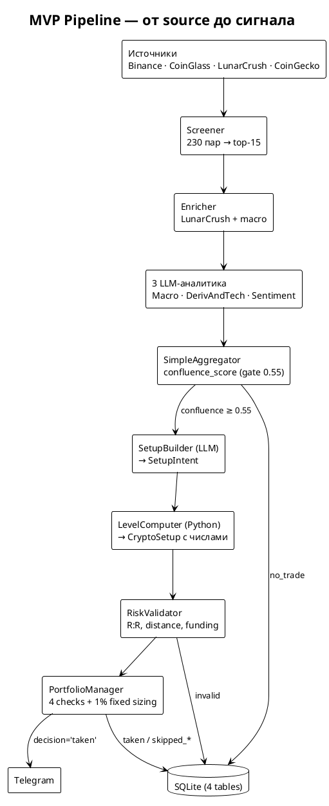
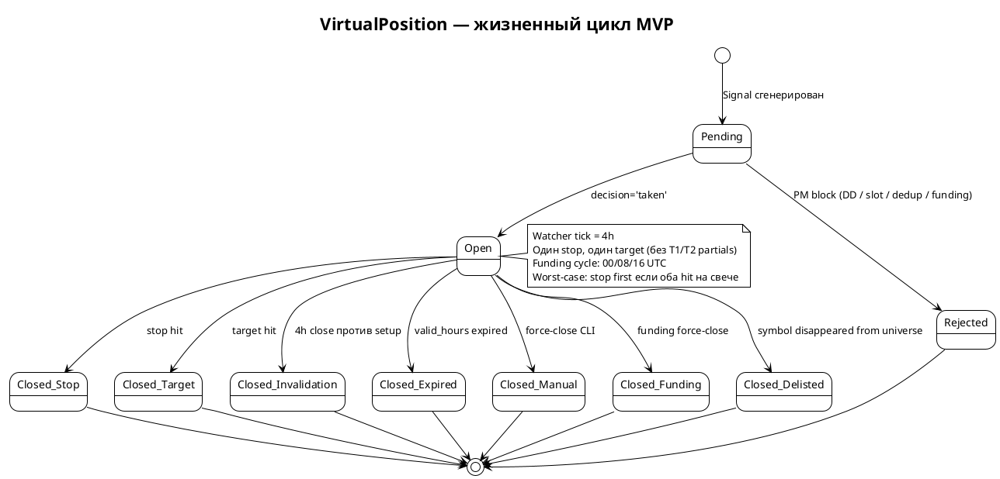

# TradingAgents — MVP Architecture (v1.0)

> ⚠️ **Историко-проектный документ.** Строки про SQLite (TEXT storage, PRAGMA, `.backup()`) устарели:
> проект на **MariaDB** (`NUMERIC(28,10)` для денег, миграции Alembic, без PRAGMA/`.backup()`).
> Актуальное — в [setup.md](setup.md), [architecture.md](architecture.md), [configuration.md](configuration.md).

**Этот документ** = минимальный жизнеспособный набор фич для первой работающей версии. Полная роадмапа — в [architecture-roadmap.md](architecture-roadmap.md).

**Цель MVP**: запустить paper trading систему за 1-2 месяца. Меньше фич — **но качество не упрощаем**.

**Цель = НЕ MVP**: всё что в `architecture-roadmap.md` помечено как "Deferred" или "Iteration 4+".

---

## Что значит "качество как на проде" (не упрощаем)

Этот список обязателен в MVP как в production-версии. Ни одна позиция не "пропускается ради скорости":

| Аспект | Требование |
|---|---|
| **Decimal для денег** | `current_balance`, `entry_price`, `qty`, `realized_pnl` — все Decimal через TypeDecorator, TEXT storage в SQLite. Float запрещён для денег |
| **UTC-aware datetime** | Везде `datetime.now(timezone.utc)`. Naive datetime запрещён linter'ом |
| **SQLite production PRAGMA** | journal_mode=WAL, synchronous=NORMAL, busy_timeout=5000, foreign_keys=ON. Без этого — corruption risk |
| **Daily backup** | SQLite native `.backup()` API, 7d rotation. Не OS-level copy в WAL режиме |
| **Idempotency** | Unique constraint `Signal(symbol, bar_close_ts)` — защита от двойного запуска scheduler'а |
| **Recovery on restart** | На старте: load `VirtualPosition.state='OPEN'`, sync с текущими ценами, продолжить watch |
| **Settings validation (Pydantic)** | Все константы через `Field(default=X, ge=Y, le=Z)`. Нет magic numbers в коде вне settings |
| **Logger sanitization** | Фильтровать KEY/TOKEN/SECRET/PASSWORD в логах |
| **Tests на critical paths** | 100% coverage на: sizing math, P&L формула, state transitions, LevelComputer resolvers. Smoke tests на full pipeline |
| **LLM cost tracking** | `litellm.success_callback` → Event(llm_call, cost_usd). Daily budget cap |
| **Signal idempotency** | Дубль scheduler tick'а на ту же 4h свечу не создаёт дубль сигнала |
| **No LLM-generated numbers** | LLM → SetupIntent (логика), Python → CryptoSetup (числа). SetupIntent + LevelComputer паттерн обязателен (см. ниже) |
| **Manual override CLI** | `halt-trading`, `resume-trading`, `force-close --position-id N` — для безопасности |
| **Vol target вместо return target** | Принцип: не задаём цель по доходности. Фиксируем риск. (Reduced to fixed 1% NAV per trade в MVP, без advanced sizing) |

---

## Состав MVP (что строим)

### Pipeline

1. **Universe selection** ✅ (готово)
2. **Screener** ✅ (готово, calibrated)
3. **Enricher** ✅ (готово)
4. **3 LLM-аналитика параллельно**:
   - MacroAnalyst → MacroReport
   - DerivAndTech (merged для MVP) → MergedReport
   - SentimentAnalyst → SentimentReport
5. **Simple Aggregator** — weighted average bias из 3 отчётов → SignalSynthesis
6. **SetupBuilder (LangGraph)** → SetupIntent (упрощённый enum, см. ниже)
7. **LevelComputer (Python)** → CryptoSetup с реальными числами
8. **RiskValidator (Python)** — R:R ≥ 1.5, stop distance в bounds, funding cost check
9. **PortfolioManager (Python, simplified)** — 4 pre-trade check'а вместо 7
10. **Position Watcher** — basic exit rules (stop, target, invalidation, expiry)
11. **Telegram notifier**

### Persistence — 4 таблицы (вместо 6 в full)

**Account** — виртуальный аккаунт. Один или несколько (разные риск-профили).

| Поле | Тип | Смысл |
|---|---|---|
| id | int | PK |
| name | str | имя |
| base_currency | str | "USDT" |
| initial_balance | Decimal | стартовый баланс |
| current_balance | Decimal | cash |
| equity | Decimal | cash + unrealized PnL |
| peak_nav | Decimal | для DD расчёта |
| created_at, updated_at | datetime UTC | |

**Signal** — decision log.

| Поле | Смысл |
|---|---|
| id, ts | PK, момент генерации |
| symbol | тикер |
| source | screener \| manual |
| screener_score, confluence_score | значения |
| direction | long \| short \| no_trade |
| setup_intent_json | сериализованный SetupIntent |
| crypto_setup_json | сериализованный CryptoSetup (от LevelComputer) |
| decision | taken \| skipped_dedup \| skipped_slot \| skipped_drawdown \| skipped_funding \| no_trade |
| decision_reason | строка |
| strategy_version | строка (semver MVP, без hash) |

Unique constraint: `(symbol, bar_close_ts)`.

**VirtualPosition** — paper trading позиция.

| Поле | Смысл |
|---|---|
| id, account_id | PK, FK |
| symbol, side | тикер, long/short |
| state | OPEN \| CLOSED |
| entry_signal_id | FK на Signal |
| entry_ts, entry_price | момент и цена входа |
| qty | размер (Decimal) |
| stop_price, target_price | один stop, один target (без T1/T2 partials в MVP) |
| exit_ts, exit_price, exit_reason | при закрытии: stop \| target \| invalidation \| expired \| manual \| extreme_funding \| delisted |
| realized_pnl, simulated_fees, simulated_funding | финал PnL разбит на компоненты |

Partial unique index: `(account_id, symbol)` WHERE `state='OPEN'`.

**Event** — append-only log.

| Поле | Смысл |
|---|---|
| id, ts | PK, момент |
| event_type | signal_generated \| position_opened \| position_closed \| stop_updated \| circuit_breaker_triggered \| llm_call \| manual_action |
| entity_type, entity_id | на что ссылается |
| payload_json | детали |

Нет архивации в MVP — растёт пока БД < 500MB, потом задумываемся.

---

## Что НЕ в MVP (deferred to full architecture)

| Что отложено | Когда вернуться |
|---|---|
| **EquitySnapshot** ежедневный | Когда нужны точные daily metrics для DSR; пока считаем on-the-fly |
| **MarketDataPIT bitemporal** | Когда делаем backtest framework |
| **DSR / PSR (Bailey & LdP)** | После 500+ закрытых сделок |
| **Walk-forward purged k-fold CV** | Когда будут исторические данные в БД |
| **Model drift detection** | Manual review каждые 1-2 недели вместо автоматики |
| **Macro event blackout calendar** | Используем `halt-trading` CLI вручную перед FOMC |
| **US-макро / TradFi контекст** (DXY, SPX/Nasdaq, ставки, Fed-календарь, risk-on/off) | Не в MVP: `MacroAnalyst` = только крипто-режим. См. раздел «Будущее: US-макро» ниже |
| **Correlation matrix rolling 30d** | Простое правило вместо матрицы: max 2 long + max 2 short |
| **Fractional Kelly + bootstrap win_prob** | Фиксированный 1% NAV per trade в MVP |
| **DD circuit breakers 3 уровня** | Один уровень: −10% NAV → halt |
| **Daily PnL stop −3%** | Не используем в MVP |
| **HMM regime detector** | Heuristic в Iteration 4 full arch; MVP не использует regime |
| **ConflictResolver, DevilsAdvocate** | Не используем в MVP |
| **Bull/Bear debate subgraph** | Никогда вероятно (см. Alpha Illusion) |
| **OnChainAnalyst + CoinMetrics** | Iter 4 full arch |
| **Trailing stop (chandelier exit)** | Один fixed stop в MVP |
| **Partial close 50% on T1 + T2** | Один target, full close |
| **mean_reversion_extreme, momentum_continuation setup types** | 3 setup types в MVP вместо 6 |
| **Confluence_zone composite reference** | Single references только |
| **OB / FVG / Volume Profile references** | Не в MVP (research: ненадёжны / overhead) |
| **Strategy version with IC weights hash** | Просто semver в MVP |
| **Event log archival policy** | Когда БД > 500MB |
| **Cross-account correlation** | Один account в MVP |
| **APScheduler с SQLAlchemyJobStore persistence** | Простой cron в shell на старте, APScheduler позже |
| **6 PlantUML диаграмм** | 2 диаграммы в MVP (main flow + state machine) |

### Будущее: интеграция US-макро / TradFi контекста (пост-MVP)

**Мотивация.** Крипта сильно ходит за макро-фоном США — политика ФРС, CPI/NFP, акции (SPX/Nasdaq), индекс доллара (DXY), общий режим risk-on/off. Текущая система этого НЕ учитывает: `MacroAnalyst` считает только **крипто-режим** (BTC dominance / price / market-cap + fear&greed), а новости берутся только **крипто-доменные** (LunarCrush). Большие макро-события в MVP обходятся **ручным `halt-trading`** перед ними.

**Что хотим добавить (в full-arch):**
- **Макро-событийный календарь** (FOMC, CPI, NFP, заседания ФРС) → авто-blackout / повышенная осторожность вокруг событий вместо ручного halt.
- **Cross-asset контекст**: DXY, SPX/Nasdaq (корреляция + режим risk-on/off), ставки/доходности.
- **`MacroContextAnalyst`** (или обогащение текущего `MacroAnalyst`): US-макро → risk-on/off + событийный флаг, который входит в синтез и/или гейт сигналов.
- **Источники данных**: экономический-календарь API (события) + котировки индексов/DXY.

**Почему отложено.** Требует новых источников данных и нового аналитика. Сначала доводим крипто-внутреннее ядро MVP (screener → аналитики → SetupIntent/LevelComputer → риск → позиции) до рабочего состояния; US-макро добавляем осознанным расширением после работающего MVP — это повышает качество сигналов, но не ценой незавершённого ядра.

---

## Принципы дизайна MVP (5 ключевых)

1. **Screener first** — Python-фильтр без LLM, top-15 кандидатов
2. **Hybrid LLM/Python для setup generation** — SetupIntent (LLM) + LevelComputer (Python). LLM **никогда не пишет торговые числа**
3. **State-aware signals** — каждый сигнал учитывает текущий PortfolioState
4. **Python для всех правил риска** — RiskValidator, PortfolioManager, sizing — детерминированы
5. **Vol target вместо return target** — фиксируем риск (1% NAV per trade), доходность = производная

---

## Pipeline (детально)

```text
ШАГ 1 — UNIVERSE  ✅ (готово)
  Все ликвидные perp-пары Binance, ≥$5M/24h volume
  → ~230 пар

ШАГ 2 — SCREENER  ✅ (готово, calibrated)
  ADX gate ≥ 20 + 15-критериальный score + 11-vote direction
  → top-15 ScreenerResult

ШАГ 3 — ENRICHER  ✅ (готово)
  Batch macro + per-symbol LunarCrush
  → EnrichedCandidate

ШАГ 4 — DEEP ANALYSIS  [MVP scope]
  Для каждого кандидата параллельно:
    • MacroAnalyst → MacroReport (LLM, structured)
    • DerivAndTech → MergedReport (LLM с tools для key levels)
    • SentimentAnalyst → SentimentReport (LLM)
  Объединение: SimpleAggregator → SignalSynthesis с confluence_score

ШАГ 5 — CONFLUENCE GATE
  if confluence_score < 0.55:
    Signal(decision='no_trade', reason='low_confluence')
    stop

ШАГ 6 — SETUP GENERATION
  SetupBuilder (LangGraph) → SetupIntent (логика)
  LevelComputer (Python) → CryptoSetup (точные цены)

ШАГ 7 — RISK VALIDATION
  R:R ≥ 1.5, stop distance ∈ [0.3%, 5%], funding cost vs valid_hours OK
  → FinalSignal или Signal(no_trade)

ШАГ 8 — PORTFOLIO MANAGER (4 pre-trade checks)
  1. Drawdown breaker (-10% NAV → halt)
  2. Slot available (max 5 positions, max 2 в одну сторону)
  3. Symbol dedup (нет уже открытой)
  4. Funding kill-switch (|funding_rate| < 0.25%)
  →  если все OK: Signal(decision='taken') + VirtualPosition(OPEN) + Event
     иначе: Signal(decision='skipped_*')

ШАГ 9 — NOTIFICATION
  Telegram сообщение с FinalSignal (русский язык)

ШАГ 10 — POSITION WATCHER (отдельный loop, 4h tick)
  Для каждой OPEN позиции:
    - проверить stop / target / invalidation / expiry
    - проверить delisting (symbol всё ещё в universe?)
    - проверить funding kill-switch для существующих
    - накопить simulated_funding на funding cycle границах (00/08/16 UTC)
    - закрыть → VirtualPosition(CLOSED) + Event + update Account
```

---

## SetupIntent enum (MVP — минимальный набор)

### Setup types (3 вместо 6 в full)

| setup_type | Когда |
|---|---|
| `trend_continuation` | Daily trend задан, pullback к ключевому уровню |
| `breakout` | Цена пробила consolidation / BB squeeze |
| `reversal` | После failed move + structure change |

### Entry references (5 вместо 10)

| Reference | Параметры |
|---|---|
| `swing_high_4h(lookback)` / `swing_low_4h(lookback)` | `lookback ∈ {10, 20, 50}` |
| `ma(period, type, tf)` | `period ∈ {20, 50}`, `type=ema`, `tf=4h` |
| `prev_day_high` / `prev_day_low` | — |
| `fib_retracement(level, swing_period=4h)` | `level ∈ {0.618, 0.786}` |
| `liq_cluster_above(strength_min)` / `liq_cluster_below(strength_min)` | `strength_min ∈ {medium, high}` — из CoinGlass (если есть Pro plan) или approximate fallback |

**В MVP нет**: confluence_zone, OB, FVG, VWAP, round numbers, volume profile, range refs (range_fade setup отсутствует).

### Stop references (3 вместо 5)

| Reference | Применение |
|---|---|
| `swing_low_4h(lookback)` / `swing_high_4h(lookback)` | Default invalidation |
| `atr_distance(multiplier)` | `multiplier ∈ {2.0, 2.5, 3.0}` — для волатильных |
| `below_liq_cluster(strength_min)` / `above_liq_cluster(strength_min)` | Только для reversal после sweep |

Обязательный параметр `stop_offset_atr: float ∈ [0.1, 3.0]`.

### Target references (3 вместо 6)

| Reference | Применение |
|---|---|
| `next_swing_high_4h` / `next_swing_low_4h` | Default |
| `prev_day_high` / `prev_day_low` | Intraday |
| `fib_extension(level)` | `level ∈ {1.272, 1.618}` |

**Один target в MVP** (без T1/T2 partial logic).

### Invalidation (2 типа)

| Reference | Логика |
|---|---|
| `close_below_4h(reference)` / `close_above_4h(reference)` | 4h close на неправильной стороне |
| `valid_hours_expiry` | По истечении valid_hours |

### Entry trigger (2 типа в MVP)

| Trigger | Применение |
|---|---|
| `at_price` | Лимит-ордер (default) |
| `after_displacement` | Ждать displacement candle ≥ 1.5×ATR (для reversal) |

### Validation constraints

Перед LevelComputer проверяется:
- direction='long' → stop_reference семантически ниже entry, targets выше
- setup_type='trend_continuation' → daily_trend (из MacroReport) совпадает с direction
- setup_type='breakout' → invalidation должна быть `close_back_inside_consolidation`
- MA timeframe ≥ entry timeframe
- valid_hours ≥ 4 (минимум одна 4h свеча)

При нарушении — один re-prompt LLM, потом No Trade.

---

## LevelComputer (MVP)

Детерминированный Python модуль. Логика:

1. **Resolve каждый reference** из SetupIntent → конкретная цена (через `find_swing()`, `compute_ma()`, `compute_fib()`, `query_liq_clusters()`)
2. **Apply offsets**: `entry_price = anchor ± entry_offset_atr × atr_4h`, `stop_price = stop_anchor ∓ stop_offset_atr × atr_4h`
3. **Sanity checks**:
   - stop < entry < target (для long)
   - все цены > 0
   - distance entry → stop ∈ [0.3%, 5%]
4. **Compute R:R** = `(target - entry) / (entry - stop)`
5. **Compile invalidation_condition** как Python predicate для Watcher
6. **Estimate funding_impact** = `funding_rate × valid_hours / 8` (один cycle на 8h)
7. **Output**: CryptoSetup со всеми числами + ссылка `setup_intent_id`

При failure (e.g. reference не resolveable) → `None`, decision='no_trade', reason='level_computation_failed'.

---

## Risk rules (MVP — упрощённые)

| Параметр | MVP значение | Полная arch (отложено) |
|---|---|---|
| Risk per trade | **1.0% NAV fixed** для всех сделок | Fractional Kelly + bootstrap |
| Max concurrent positions | **5** | 5-8 с correlation matrix |
| Max same-direction | **2 long + 2 short одновременно** | Correlation budget |
| DD breaker | **−10% NAV → halt all new entries** | 3 уровня (-5/-8/-15) |
| Daily PnL stop | **не используем** | -3% / day |
| Vol target | **не используем (fixed sizing)** | 20-25% annualized |
| Funding kill-switch | **|funding_rate| > 0.25% → reject new + force-close existing** | 2 порога (0.20 / 0.30) |
| Symbol dedup | **обязательно** | -//- |
| Delisting check | **daily** | -//- |
| Strategy version | **semver only (1.0.0)** | semver + hash |

---

## Operations (MVP)

### Запуск
- `APScheduler` или `cron` (для MVP cron достаточен) — каждые 4h на bar close + 60s lag
- Watcher как отдельный процесс с тем же tick'ом

### Recovery on restart
1. Прочитать все `VirtualPosition.state='OPEN'`
2. Запросить свежую цену каждой
3. Проверить exit rules задним числом (если за время downtime сработал stop/target — закрыть по той цене)
4. Continue watching
5. Log Event(event_type='restart_recovery')

**Не делаем в MVP**: event log replay, sync market data PIT. Если что-то не так — manual investigation.

### Manual override CLI
- `halt-trading [--reason]` — pauses new signals
- `resume-trading`
- `force-close --position-id N --reason "manual"`
- `manual-signal --symbol BTC --side long --entry X --stop Y --target Z` — bypass screener (для edge cases)

### Delisting check
Daily UTC 00:00 cron:
- Для каждой OPEN VirtualPosition проверить symbol ∈ universe
- Если нет → force-close по last known price, exit_reason='delisted', Event
- Telegram уведомление

### Macro halt
В MVP — manual через `halt-trading` CLI перед FOMC / CPI. Calendar — в full arch.

### LLM cost tracking
- `litellm.success_callback` пишет каждый call как Event(event_type='llm_call', payload={model, tokens, cost_usd})
- `LLM_DAILY_BUDGET_USD = 5.0` (env var) — hard cap
- При превышении: `Signal(decision='no_trade', reason='llm_budget_exceeded')`

### Backup
- Daily `.backup()` SQLite native, 7d rotation, директория `~/.tradingagents/backups/`
- При запуске system проверяет последний backup не старше 25 часов; если старше — warning в log

---

## Production Conventions (все обязательны в MVP)

| Convention | Деталь |
|---|---|
| **Decimal** | TEXT storage через TypeDecorator. Денежные поля, qty, цены — Decimal. Float ОК для %, vol, correlations |
| **UTC datetime** | timezone-aware всегда; ISO 8601 с suffix Z в JSON |
| **Database path** | `TRADINGAGENTS_DB_PATH` env var, default `~/.tradingagents/trading.db` |
| **SQLite PRAGMA** | journal_mode=WAL, synchronous=NORMAL, busy_timeout=5000, foreign_keys=ON, cache_size=-64000, temp_store=MEMORY |
| **Logging** | structured (key=value); sanitize KEY/TOKEN/SECRET/PASSWORD |
| **Settings** | Pydantic BaseSettings с явными ge/le на числовые поля |
| **API keys** | только через env vars (.env с .gitignore) |
| **Idempotency** | UNIQUE на Signal(symbol, bar_close_ts) + partial UNIQUE на VirtualPosition(account, symbol, OPEN) |
| **Тесты** | pytest. Coverage gate 70% на новый код. 100% на: sizing, P&L, state machine transitions, LevelComputer resolvers. Property-based — на P&L инварианты (можно отложить, не критично для MVP) |
| **CI** | ruff + mypy на новый код. Alembic upgrade head dry-run |
| **Recovery** | restart-safe для OPEN positions (см. выше) |

---

## План реализации MVP (5 итераций ~6-8 недель)

### Iter 1: Persistence (1 неделя) — фундамент  🔶 почти готово

- ✅ SQLite + SQLModel: 4 модели (Account, Signal, VirtualPosition, Event)
- ✅ Alembic init + первая миграция (`79626e30ba81_initial_schema`)
- ✅ Repository слой (CRUD): account, signal, event, virtual_position
- ✅ TypeDecorator для Decimal (`DecimalText`, TEXT storage) + `UTCDateTime` (reject naive)
- ✅ SQLite production PRAGMA (WAL/synchronous/busy_timeout/foreign_keys) на каждый коннект
- ✅ Settings.py с валидаторами для всех констант
- 🔲 Daily backup cron — константы в settings есть (`DB_BACKUP_*`), кода бэкапа ещё нет
- 🔶 CLI: `create-account` ✅, `show-account` ✅, `equity-curve` 🔲
- 🔲 Data quality monitors basic (freshness check для свечей)
- ✅ Тесты: `tests/db/` (constraints, repositories, types)

**Acceptance**: создать аккаунт, открыть/закрыть VirtualPosition вручную, увидеть в БД, перезапустить процесс, увидеть persistent state.

### Iter 2: LLM Analysts + Aggregator (1.5 недели)  🔶 инфра готова, аналитики нет

**Решение по схеме (отход от MVP):** вместо 3 аналитиков с merged Deriv+Tech выбрана полная 4-агентная схема — Macro / Derivatives / Technical (LangGraph с tools) / Sentiment раздельно. Модели уже в `app/analysts/models.py`.

LLM-инфра построена (пакет `app/llm/`):

- ✅ Обёртка LLM-вызова: `LLMClient` (litellm + instructor, structured output → Pydantic), возвращает `(parsed, LLMUsage)`
- ✅ LLM cost tracking: `LLMService` пишет каждый вызов в `Event(llm_call)` с {model, tokens, cost_usd, latency_ms}. Реализовано явной записью в БД, **не** через `litellm.success_callback` (учёт в отдельном `session_scope`, переживает откат транзакции сигнала)
- ✅ Daily budget gate: `DailyBudgetGuard` — сумма `cost_usd` за UTC-сутки vs `LLM_DAILY_BUDGET_USD` (env, default $5). Soft cap при гонке параллельных вызовов
- ✅ Settings: `ANTHROPIC_API_KEY`, `LLM_DAILY_BUDGET_USD`, `LLM_MAX_OUTPUT_TOKENS`, `LLM_MAX_RETRIES`, `LLM_TEMPERATURE`; smoke-команда `llm-test`
- 🔲 MacroAnalyst → MacroReport
- 🔲 DerivativesAnalyst → DerivativesReport
- 🔲 TechnicalAnalyst (LangGraph граф с tools) → TechnicalReport
- 🔲 SentimentAnalyst → SentimentReport
- 🔲 SignalAggregator → SignalSynthesis с confluence_score

**Acceptance**: для одного кандидата от screener получить SignalSynthesis с осмысленным confluence_score и breakdown по аналитикам. LLM_cost залогирован.

### Iter 3: SetupIntent + LevelComputer (1.5 недели) — **ключевое**

- SetupBuilder LangGraph граф с output structured как SetupIntent
- LevelComputer: 5 entry resolvers + 3 stop + 3 target + 2 invalidation + offsets
- SetupIntentValidator (constraints check)
- RiskValidator (R:R, distance bounds, funding cost)
- SignalFormatter → FinalSignal

**Acceptance**: SignalSynthesis с confluence ≥0.55 → SetupIntent от LLM → конкретные числа от LevelComputer → валидный FinalSignal или явный no_trade с reason.

### Iter 4: PortfolioManager + Watcher (1.5 недели)

- PortfolioManager с 4 pre-trade checks (drawdown, slot, dedup, funding)
- Fixed 1% sizing
- Position Watcher loop (4h tick)
- Exit rules: stop / target / invalidation / expiry / funding_force_close / delisted
- Funding accrual на cycle boundaries
- Restart recovery
- Manual override CLI

**Acceptance**: пройти полный цикл от screener tick → signal taken → VirtualPosition OPEN → watch through 4h candles → close по stop или target. Restart в середине — позиция сохраняется.

### Iter 5: Delivery + Polish (1 неделя)

- Telegram bot с FinalSignal формат (русский)
- APScheduler внутри процесса (или cron на хосте)
- Daily delisting check
- Simple equity curve report (CLI: `equity-curve --last-30d`)
- Basic metrics: win rate, avg R:R, total return, max DD
- E2E smoke test

**Acceptance**: запустить систему, проработала 1 неделю, выдала N сигналов, увидеть decision log в БД, статистику в CLI, уведомления в Telegram.

---

## Когда переходить от MVP к full arch

После того как MVP прошёл **6 месяцев** живого paper trading и:

- ≥100 закрытых сделок
- Equity curve не катастрофическая (max DD < 20%)
- Win rate ≥45% или expectancy positive
- LLM cost-per-signal приемлемый (< 5% от average realized R per trade)

**Тогда** — итеративно подтягивать из `architecture-roadmap.md`:

1. **EquitySnapshot daily** + **basic Sharpe / Sortino** (просто, недорого)
2. **Correlation matrix** + **adjusted DD breakers** (если поняли что простое правило недостаточно)
3. **Fractional Kelly** (после 100+ сделок есть empirical win_prob)
4. **Confluence_zone composite reference** (если single references слабо работают)
5. **Дополнительные setup_types** (mean_reversion_extreme, momentum_continuation)
6. **DSR/PSR + walk-forward CV** (для честной валидации перед live deployment)
7. **HMM regime detector** (когда есть BTC daily returns history)
8. **Macro event blackout calendar** (когда устанем halt'ить вручную)

**До этого** — не трогать, не "улучшать архитектуру". Это правило важнее всех остальных.

---

## Диаграммы MVP (2 диаграммы)

### 1. Главный поток данных



### 2. Жизненный цикл VirtualPosition



---

## Educated guesses в MVP (то же что в full)

Все "магические числа" из MVP — те же placeholder'ы что в full architecture, помечены как tunable settings. После 3+ мес live paper trading — sensitivity analysis на топ-5:

1. `CONFLUENCE_GATE` (0.55) — может быть слишком низким/высоким
2. `SCREENER_SCORE_MIN` (4) — sensitivity обязательна
3. `RISK_PER_TRADE` (1.0%) — может быть aggressive для starting period
4. `TOP_N_CANDIDATES` (15) — LLM cost driver
5. `DRAWDOWN_HALT_LEVEL` (−10%) — risk tolerance

Все остальные guesses (FUNDING thresholds, distance bounds, ATR multipliers, MA periods) — переоценить по результатам первых 50+ сделок.

---

## Связь с полной архитектурой

`architecture-roadmap.md` — это **2055 строк** полной production-grade спецификации. Этот документ — её **MVP-срез**:

| Покрытие | MVP | Full |
|---|---|---|
| Pipeline стадий | 10 | 12 (+ ConflictResolver, DevilsAdvocate) |
| LLM-аналитиков | 3 | 5 (+ OnChain, DevilsAdvocate) |
| Persistence таблиц | 4 | 6 |
| SetupIntent setup types | 3 | 6 |
| Entry references | 5 | 10 |
| Stop references | 3 | 5 |
| Target references | 3 | 6 |
| Pre-trade checks | 4 | 7 |
| Risk параметров | 5 | 15+ |
| Performance metrics | 4 (basic) | 14 (с DSR/PSR/walk-forward) |
| Диаграмм | 2 | 6 |
| Lines в спеке | ~700 | 2055 |

Quality bar (Decimal/UTC/PRAGMA/backup/idempotency/recovery/tests/no LLM-numbers) — **тот же**.

При расширении MVP → full: правки делать **в обоих документах** до момента когда MVP становится legacy и можно удалить. Альтернатива — переписать MVP как "историческую справку" что было в v1.0, когда система уже full.
